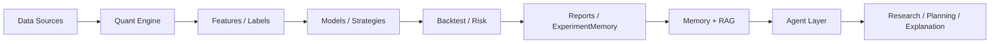

# Quant MAS

**A research-first Multi-Agent System for quantitative research, backtesting, risk control, memory, RAG, and explainable experiment workflows.**<br>
**Quant MAS 是一个面向科研、学习和实习作品集的多智能体量化研究平台：让确定性 Quant Engine 做计算，让 Agent Layer 做编排、解释和报告。**

[](https://github.com/ytq0198/Quant-MAS)
[](https://www.python.org/)
[](docs/progress.md)
[](docs/progress.md)
[](#license)
[](docs/architecture.md)

> This is **not** an autonomous live-trading bot. LLM agents never place live orders directly.<br>
> 这不是让 LLM 直接实盘交易的系统。LLM Agent 不允许直接下单，所有信号必须经过回测、风控、审计和人工确认。

---

## Why Quant MAS?

Quant MAS is designed for students, researchers, and internship candidates who want a credible end-to-end project that combines:

- deterministic quantitative research,
- machine learning experiments,
- multi-agent tool orchestration,
- experiment memory and RAG,
- explainable research reports,
- and reproducible tests without relying on real network calls.

Quant MAS 适合希望展示完整工程能力的同学：从行情数据、特征、策略、回测、风控，到机器学习、文本信号、Agent 编排、Memory/RAG 和实验报告，形成一个可扩展的科研平台。

---

## Quick Start

```bash
git clone https://github.com/ytq0198/Quant-MAS.git
cd Quant-MAS

python -m pip install -e .
python -m pytest -v
python -c "import quant_mas; print('Quant MAS ready')"
```

Current verified baseline: **161 tests passed**. Tests use synthetic data, mocks, and local files only.

当前测试基线：**161 passed**。测试不依赖真实网络请求、不调用真实 LLM API、不下载大模型权重。

---

## CLI Examples

### Build features and run a local pipeline

```bash
python scripts/run_pipeline.py \
  --symbols AAPL MSFT SPY \
  --start 2018-01-01 \
  --end 2025-12-31 \
  --skip-download \
  --strategy ma_cross \
  --experiment-name local_ma_cross_demo
```

### Train a direction model

```bash
python scripts/train_model.py \
  --config configs/train.yaml \
  --storage-config configs/storage.yaml \
  --experiment-name local_lgbm_demo
```

### Run ML signal backtest

```bash
python scripts/run_ml_backtest.py \
  --config configs/backtest_ml.yaml \
  --storage-config configs/storage.yaml \
  --experiment-name local_ml_backtest_demo
```

### Run ResearchAgent without real LLM

```bash
python scripts/run_research_agent.py \
  --task "Summarize OOS baseline vs latest ML run"
```

### Generate mock text signals

```bash
python scripts/train_text_model.py \
  --mode mock \
  --config configs/text_model.yaml \
  --dry-run
```

---

## SupervisorAgent Example

```python
from quant_mas.agents import SupervisorAgent
from quant_mas.tools import ToolRegistry, DataSummaryTool

registry = ToolRegistry([DataSummaryTool()])
agent = SupervisorAgent(registry)

result = agent.run(
    "summarize this dataset",
    data_path="data/features/features.parquet",
)

print(result.content)
```

The current SupervisorAgent uses deterministic rule routing. It does not call a real LLM and does not place trades.

当前 SupervisorAgent 使用规则路由，不调用真实 LLM，也不会下单。

---

## Features

| Layer | English | 中文 |
|---|---|---|
| Quant Engine | Data storage, features, strategies, backtesting, metrics, risk checks, ML training | 数据、特征、策略、回测、绩效、风控、模型训练 |
| MAS Agent | Tool registry, SupervisorAgent, ReportAgent, ResearchAgent | 工具注册、监督智能体、报告智能体、研究智能体 |
| Memory/RAG | JSON and SQLite experiment memory, trade memory stub, keyword/vector/hybrid retrieval | 实验记忆、交易记忆雏形、关键词/向量/混合检索 |
| LangGraph | Optional workflow backend with sequential fallback | 可选工作流编排，保留轻量顺序执行 |
| ML | LightGBM/XGBoost-ready direction modeling, MLSignalStrategy, walk-forward OOS evaluation | 方向模型、机器学习信号策略、样本外 walk-forward |
| Text Signals | Mock/FinBERT/LoRA skeleton, text signal merge into feature tables | 文本情绪信号、FinBERT/LoRA 骨架、文本特征融合 |
| Research Protocol | Baseline registry, experiment comparison, OOS metric discipline | 研究基线、实验对比、论文主指标使用 OOS |

---

## Architecture


<details>
<summary>Mermaid diagram (click to expand)</summary>



</details>

Read more: [docs/architecture.md](docs/architecture.md) and [docs/index.md](docs/index.md).

---

## Resume Usage

**English**

> Built Quant MAS, a Python 3.11 multi-agent quantitative research platform with deterministic data/feature/model/backtest/risk pipelines, LightGBM-based ML signal experiments, walk-forward OOS evaluation, experiment memory, RAG retrieval, optional LangGraph orchestration, and mock-safe LLM research agents. Maintained 161 passing pytest cases and strict safeguards preventing LLM agents from direct live trading.

**中文**

> 开发 Quant MAS 多智能体量化研究平台，基于 Python 3.11 实现数据、特征、模型、策略、回测、风控和报告的确定性量化闭环；支持 LightGBM 方向模型、MLSignalStrategy、Walk-forward 样本外评估、ExperimentMemory、Memory/RAG、可选 LangGraph 编排和 Mock-safe LLM ResearchAgent；维护 161 项 pytest 通过，并明确限制 LLM Agent 不直接参与实盘下单。

---

## Roadmap

- [x] Project skeleton, pytest, configs, docs
- [x] Parquet storage and data catalog
- [x] OHLCV validation and market data fetchers
- [x] Technical features, labels, strategy, backtest, risk
- [x] Experiment memory and backtest reports
- [x] LightGBM direction model and ML backtest
- [x] Lightweight Agent Core and SupervisorAgent
- [x] Walk-forward OOS evaluation
- [x] Memory/RAG v2 with JSON, SQLite, vector store skeleton
- [x] Context engineering and optional OpenAI-compatible LLM client
- [x] Text signal layer with mock/FinBERT/LoRA skeleton
- [ ] Plus **M7** RL/GRPO simulation skeleton
- [ ] Plus **M8** MCP/A2A protocol adapters
- [ ] Stronger ResearchAgent workflows and report templates
- [ ] More robust real-data experiments and ablation studies
- [ ] Optional production-grade deployment docs

---

## Documentation

- [Documentation Index](docs/index.md)
- [Architecture](docs/architecture.md)
- [Progress](docs/progress.md)
- [Experiment Log](docs/experiment_log.md)
- [Research Protocol](docs/research_protocol.md)
- [Server Commands](docs/server_commands.md)
- [Text Model Plan](docs/text_model_plan.md)
- [Repo Polish Checklist](docs/repo_polish_checklist.md)

---

## Contributing

Issues, pull requests, experiment reports, and good-first-issue ideas are welcome.<br>
欢迎 Star / Fork / Issue / PR，也欢迎把它作为课程项目、科研项目或实习作品集继续扩展。

Start here: [CONTRIBUTING.md](CONTRIBUTING.md)

Contact: **3240101782@zju.edu.cn**

---

## License

MIT License. See [LICENSE](LICENSE).

---

## Disclaimer

Quant MAS is for **research and education only**. It is not financial advice, investment advice, or a recommendation to buy or sell any asset. Backtest results and model outputs are experimental and may be wrong, incomplete, or overfit.

Quant MAS 仅用于科研和教育目的，不构成任何投资建议、交易建议或收益承诺。任何策略、模型、回测结果都必须经过独立验证、风控审计和人工确认。
