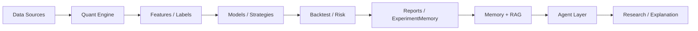

# Quant MAS — 多智能体量化研究平台 / Multi-Agent Quantitative Research Platform

> 这是一个面向 **AI Agent / Quant / ML** 实习与科研申请者的开源项目：可运行、可回测、可训练、可记录。  
> A **resume-ready** research platform for AI Agent & Quant internships — backtesting, ML training, memory/RAG, and safe agent orchestration.

[](https://github.com/ytq0198/Quant-MAS)
[](https://github.com/ytq0198/Quant-MAS/releases/tag/v0.1.0)
[](https://www.python.org/)
[](docs/progress.md)
[](docs/progress.md)
[](LICENSE)
[](docs/architecture.md)

> **Not a live-trading bot.** LLM agents never place live orders directly.  
> **非实盘系统。** LLM Agent 不允许直接下单；所有信号须经回测、风控、审计和人工确认。

---

## 目录 / Table of Contents

- [项目简介 / Project Overview](#项目简介--project-overview)
- [架构 / Architecture](#架构--architecture)
- [项目亮点 / Features](#项目亮点--features)
- [快速开始 / Quick Start](#快速开始--quick-start)
- [运行示例 / CLI Examples](#运行示例--cli-examples)
- [Agent 工作流 / Agent Workflow](#agent-工作流--agent-workflow)
- [实验结果摘要 / Experiment Results](#实验结果摘要--experiment-results)
- [简历写法参考 / Resume Usage](#简历写法参考--resume-usage)
- [项目结构 / Project Structure](#项目结构--project-structure)
- [文档 / Documentation](#文档--documentation)
- [Roadmap](#roadmap)
- [贡献指南 / Contributing](#贡献指南--contributing)
- [License](#license)
- [免责声明 / Disclaimer](#免责声明--disclaimer)
- [社交 & 联系方式 / Contact & Social](#社交--联系方式--contact--social)

---

## 项目简介 / Project Overview

**Quant MAS** integrates a **deterministic Quant Engine** (data → features → models → strategies → backtest → risk → reports) with a **lightweight Agent Layer** (tool routing, research narration, optional LLM) and **Memory/RAG** for experiment retrieval.

**Quant MAS** 将确定性量化引擎与轻量 Agent 层、Memory/RAG 结合：Quant Engine 负责计算与 metrics，Agent 负责编排、解释与报告，二者边界清晰。

**Design principle / 设计原则**

> Quant Engine computes. Agent Layer explains, orchestrates, and reports.  
> Quant Engine 做计算；Agent Layer 做编排、解释与报告。

**Plus v2 status / 当前进度**：**M1–M8 ✅** · **v3 M9–M12.4 ✅** 双端（**310 pytest**）

**v3 next / 下一步**：EXP-TEXT-WF-002 服务器 walk-forward（先 audit 覆盖率）· M13 编排

---

## 架构 / Architecture


<details>
<summary>Mermaid diagram / 点击展开流程图</summary>



</details>

Details: [docs/architecture.md](docs/architecture.md) · [docs/index.md](docs/index.md)

---

## 项目亮点 / Features

| Layer | English | 中文 |
|-------|---------|------|
| **Quant Engine** | Parquet storage, OHLCV validation, features, MA Cross / ML strategies, backtest, risk, metrics | 数据、特征、策略、回测、风控、绩效 |
| **ML** | LightGBM direction model, MLSignalStrategy, **walk-forward OOS** evaluation | 方向模型、ML 信号策略、样本外 walk-forward |
| **MAS Agent** | `ToolRegistry`, **SupervisorAgent** (rule routing), **ReportAgent**, **ResearchAgent** | 工具注册、监督路由、报告与研究智能体 |
| **Memory / RAG** | JSON & SQLite experiment memory, hybrid retrieval, index/query CLI | 实验记忆、混合检索、文档索引 |
| **Enterprise DB (v3 M9)** | Postgres memory, **pgvector**, Neo4j graph skeleton; `json \| sqlite \| postgres` factory | 企业级持久化；服务器 **EXP-026** ✅（443 pgvector chunks） |
| **LangGraph** | Optional 6-node ResearchWorkflow DAG + sequential fallback | 可选工作流编排（`[orchestration]` extra） |
| **Context / LLM (v3 M10)** | ContextBuilder, `mock \| openai_compatible \| **local_vllm**`; server **Qwen2.5-7B** via vLLM (EXP-LLM-002) | 上下文工程；pytest 默认 Mock；a6000 本地推理见 `docs/server_commands.md` §6.13 |
| **RL Simulation (M7)** | TradingEnv, buy-and-hold / random / ML-copy baselines; GRPO-style ranking | RL 模拟骨架；`simulation.*` 不与 OOS 混比 |
| **Competitive Learning (v3 M11)** | StrategyAgent pool, Elo, `run_competitive_experiment.py` | 单轮 shadow simulation；`population.*` ≠ OOS |
| **Population Training (v3 M11.5)** | `PopulationTrainingLoop`, multi-gen Top-K + mutation | `run_population_training.py` |
| **Candidate Bridge (v3 M11.6)** | Top-K → `StrategyCandidate` → backtest smoke | `export_population_candidates.py`；`backtest.*` ≠ OOS |
| **Batch candidate OOS (v3 M11.8)** | Top-K OOS comparison table | `batch_validate_candidates.py`；ablation vs **0.586** |
| **Candidate OOS (v3 M11.7)** | Walk-forward OOS hook for candidates | `validate_candidate_oos.py`；**唯一**候选链路可写 `oos.*` |
| **Protocol (M8)** | MCP/A2A internal adapter, AgentCard export, policy deny shell/broker/secrets | 协议层 adapter；不接外部 MCP server |
| **Text Signals (M6)** | Mock / FinBERT / LoRA **skeleton**, merge into feature tables | 文本情绪特征骨架，不替代 LightGBM |
| **Research Protocol (M1)** | Baseline registry, `compare_experiments.py`, OOS metric discipline | 实验基线对比；论文主指标用 OOS |

---

## 快速开始 / Quick Start

```bash
git clone https://github.com/ytq0198/Quant-MAS.git
cd Quant-MAS

python -m pip install -e .
python -m pytest -v
python -c "import quant_mas; print('Quant MAS ready')"
```

**Optional extras / 可选依赖**

```bash
python -m pip install -r requirements-data.txt    # market data fetchers
python -m pip install -r requirements-ml.txt      # LightGBM
python -m pip install -e ".[orchestration]"       # LangGraph workflow
python -m pip install -e ".[llm]"                 # HTTP LLM client
python -m pip install -e ".[text]"                # FinBERT / LoRA (server manual)
```

**Verified baseline / 已验证基线**：**282 passed** 双端（EXP-034 / EXP-POP-007 @ `e291cf9`）

---

## 运行示例 / CLI Examples

### End-to-end pipeline / 端到端 pipeline

```bash
python scripts/run_pipeline.py \
  --symbols AAPL MSFT SPY \
  --start 2018-01-01 \
  --end 2025-12-31 \
  --skip-download \
  --strategy ma_cross \
  --experiment-name local_ma_cross_demo
```

### Train LightGBM / 训练方向模型

```bash
python scripts/train_model.py \
  --config configs/train.yaml \
  --storage-config configs/storage.yaml \
  --experiment-name local_lgbm_demo
```

### ML signal backtest / ML 信号回测

```bash
python scripts/run_ml_backtest.py \
  --config configs/backtest_ml.yaml \
  --storage-config configs/storage.yaml \
  --experiment-name local_ml_backtest_demo
```

### Walk-forward OOS / 样本外 walk-forward

```bash
python scripts/run_walk_forward.py \
  --config configs/walk_forward.yaml \
  --storage-config configs/storage.yaml \
  --experiment-name local_walk_forward_demo
```

### SupervisorAgent (rule routing) / 规则路由

```bash
python scripts/run_agent.py \
  --task "summarize this dataset" \
  --data-path data/features/features.parquet
```

### ResearchAgent (mock-safe / local vLLM) / 研究解释

```bash
# Default: Mock LLM (CI-safe)
python scripts/run_research_agent.py \
  --task "Summarize OOS baseline EXP-20260602-008 (oos.sharpe ≈ 0.586)"

# Server: requires vLLM on :8000 (see docs/server_commands.md §6.13)
export VLLM_BASE_URL=http://127.0.0.1:8000
export VLLM_MODEL=Qwen/Qwen2.5-7B-Instruct
python scripts/run_research_agent.py \
  --provider local_vllm --use-llm \
  --task "Interpret walk-forward OOS baseline only; list three research risks."
```

### Mock text signals / 文本信号（mock）

```bash
python scripts/train_text_model.py \
  --mode mock \
  --config configs/text_model.yaml \
  --dry-run
```

### Export population candidates (M11.6) / 导出种群候选

```bash
python scripts/export_population_candidates.py \
  --population-config configs/population_training.yaml \
  --top-k 2 \
  --run-backtest-smoke \
  --dry-run
```

### Validate candidate OOS (M11.7) / 候选 Walk-forward OOS

```bash
python scripts/export_population_candidates.py \
  --population-config configs/population_training.yaml \
  --top-k 2 \
  --run-backtest-smoke \
  --no-dry-run   # writes outputs/candidates/candidates.json

python scripts/validate_candidate_oos.py \
  --candidate-json outputs/candidates/candidates.json \
  --features-path data/features/features.parquet \
  --config configs/candidate_oos.yaml \
  --dry-run
```

Server (a6000): use `/mnt/localDisk3/weizian/datasets/features/features.parquet` instead of `data/features/features.parquet`.

### Batch validate candidate OOS (M11.8) / 批量候选 OOS 比较

```bash
python scripts/batch_validate_candidates.py \
  --candidate-json outputs/candidates/candidates.json \
  --features-path /mnt/localDisk3/weizian/datasets/features/features.parquet \
  --config configs/candidate_oos.yaml \
  --top-k 5 \
  --no-dry-run
```

Outputs: `outputs/candidate_oos_batch/candidate_oos_comparison.csv` / `.md` (EXP-POP-006 ✅).

### Compare experiments / 实验对比

```bash
python scripts/compare_experiments.py \
  --storage-config configs/storage.yaml \
  --output-dir outputs/research
```

---

## Agent 工作流 / Agent Workflow

Quant MAS uses **real, implemented** agents — not a separate broker layer.

当前已实现的两条 Agent 路径：

**1. SupervisorAgent + Quant Tools（规则路由）**

```
User task → SupervisorAgent → ToolRegistry → one of 7 tools
  (data_summary | backtest | train_model | report | risk_check | ml_backtest | pipeline)
```

**2. ResearchWorkflow DAG（Plus M4，optional LangGraph）**

```
download → features → train → ml_backtest → risk → report
  (sequential fallback always available; LangGraph optional)
```

**3. ResearchAgent（Plus M5，解释层）**

```
Memory/RAG + metrics → ContextBuilder → ResearchAgent → hypotheses & narrative
  (does NOT modify metrics or place orders)
```

Python snippet / 代码示例：

```python
from quant_mas.agents import SupervisorAgent
from quant_mas.tools import ToolRegistry, DataSummaryTool

registry = ToolRegistry([DataSummaryTool()])
agent = SupervisorAgent(registry)

result = agent.run(
    "summarize this dataset",
    data_path="data/features/features.parquet",
)
print(result.content)
```

---

## 实验结果摘要 / Experiment Results

| Item | Value | Notes |
|------|-------|-------|
| **RL feature_linear OOS (M12.4)** | `rl_feature_linear_policy_001_1` | **oos.sharpe 0.387** vs ML **0.586**（EXP-POP-010 ✅） |
| **pytest** | **326 passed** | EXP-TEXT-WF-003-PREP 本地；服务器 **314** @ WF-002 |
| **Text coverage audit** | `audit_text_signals.py` | EXP-TEXT-WF-002-PREP ✅（**非 OOS**） |
| **RL candidate OOS (M12.3)** | `rl_grpo_policy_001_1` walk-forward | **oos.sharpe 0.0**（全现金 ablation；**≠ simulation 6.31**）EXP-POP-009 ✅ |
| **RL training (M12.1)** | GRPO loop + checkpoint | **simulation.sharpe_mean 6.31**（**≠ OOS 0.586**）EXP-POP-007 ✅ |
| **batch candidate OOS (M11.8)** | 4 mean-reversion candidates | best **oos.sharpe 1.039** vs ML **0.586**（EXP-POP-006 ✅） |
| **candidate OOS (M11.7)** | `cand_mean_rev_1` walk-forward OOS | **oos.sharpe 1.036** vs ML baseline **0.586**（EXP-POP-005 ✅） |
| **population training** | 3-gen loop dry-run | EXP-POP-003 ✅ |
| **local vLLM smoke** | ResearchAgent `local_vllm` | EXP-LLM-002（Qwen2.5-7B @ a6000） |
| **Postgres/pgvector smoke** | `query_memory` + `index_documents` | EXP-026（6 experiments, **443 chunks**） |
| **OOS baseline** | **sharpe 0.586** | EXP-20260602-008, 19 walk-forward windows |
| **OOS + FinBERT text** | **sharpe 0.563** | EXP-TEXT-WF-001 · exploratory (200/6033 text coverage) |
| Single-segment ML backtest | sharpe 2.78 | ⚠️ in-sample — **not** paper metric |
| GPU LightGBM | verified on server | CUDA path documented in `docs/server_commands.md` |

**Research rule / 科研规则**：paper-level conclusions must use **walk-forward OOS** metrics and compare via `compare_experiments.py`. See [docs/research_protocol.md](docs/research_protocol.md).

---

## 简历写法参考 / Resume Usage

**English**

> Built **Quant MAS**, a Python 3.11 multi-agent quantitative research platform with deterministic quant pipelines, walk-forward OOS evaluation (baseline sharpe 0.586), Memory/RAG, optional LangGraph, enterprise DB backends (Postgres/pgvector), **local vLLM ResearchAgent** (EXP-LLM-002), **competitive learning chain** (M11–M11.8: population → StrategyCandidate → walk-forward OOS → batch comparison), **RL train→export→OOS ablation** (M12.1–M12.4, including observation-aware `FeatureLinearPolicyAgent`), text signals, MCP-style protocol adapter, and mock-safe LLM defaults. Maintained **308 passing pytest** cases with strict safeguards preventing LLM agents from direct live trading.

**中文**

> 基于 Python 3.11 构建 **Quant MAS** 多智能体量化研究平台，完成 Walk-forward OOS、风控、Agent 编排、Memory/RAG、**v3 企业 DB**、**本地 vLLM（M10）**、**竞争学习链路（M11→M11.8：种群→候选→OOS→批量比较）**、文本信号、RL 模拟与 **MCP/A2A 协议层（M8）**；维护 **266 项 pytest** 通过，明确 LLM Agent 不直接参与实盘下单。

---

## 项目结构 / Project Structure

```text
Quant-MAS/
├── src/quant_mas/          # core package
│   ├── data/               # storage, fetchers, validation
│   ├── features/           # technical, labels, text_signals
│   ├── models/               # LightGBM direction model
│   ├── strategies/           # ma_cross, ml_signal
│   ├── backtest/             # engine, walk_forward, metrics
│   ├── risk/                 # limits, drawdown guard
│   ├── agents/               # supervisor, report, research, strategy (M11)
│   ├── tools/                # 7 quant tools
│   ├── memory/               # experiment memory: json | sqlite | postgres (M9)
│   ├── rag/                  # retriever, in-memory + pgvector (M9)
│   ├── context/              # ContextBuilder (M5)
│   ├── core/                 # llm.py — mock | openai_compatible | local_vllm (M10)
│   ├── text/                 # text signals (M6)
│   ├── rl/                   # TradingEnv (M7), population training, candidate bridge (M11–M11.6)
│   ├── protocols/            # MCP/A2A adapter (M8)
│   ├── orchestration/        # LangGraph workflow (M4)
│   └── research/             # baseline registry (M1), StrategyCandidate (M11.6), candidate OOS (M11.7–M11.8)
├── scripts/                  # CLI entrypoints
├── configs/                  # YAML configs (+ llm.server.yaml.example)
├── tests/                    # 308 pytest cases
├── docs/                     # architecture, progress, experiment log, server_commands
├── architecture.png          # architecture diagram
├── CONTRIBUTING.md
├── LICENSE
└── README.md
```

---

## 文档 / Documentation

| Doc | Description |
|-----|-------------|
| [docs/index.md](docs/index.md) | Documentation hub (bilingual) |
| [docs/progress.md](docs/progress.md) | Plus v2 M1–M8 + v3 M9/M10 progress |
| [项目进度.md](项目进度.md) | 中文进度总览（Plus v2 收官 + v3） |
| [项目v3设计.md](项目v3设计.md) | v3 roadmap M9–M13 |
| [docs/experiment_log.md](docs/experiment_log.md) | Verified experiments (EXP-LLM-002, OOS 0.586, …) |
| [docs/research_protocol.md](docs/research_protocol.md) | OOS metric rules |
| [docs/server_commands.md](docs/server_commands.md) | Server deploy, vLLM §6.13, Postgres §6.12 |
| [docs/database_setup.md](docs/database_setup.md) | M9 Postgres / pgvector / Neo4j |
| [docs/population_training.md](docs/population_training.md) | M11.5 multi-gen training loop |
| [docs/strategy_candidate_bridge.md](docs/strategy_candidate_bridge.md) | M11.6 Top-K → Quant Engine bridge |
| [docs/candidate_oos_batch.md](docs/candidate_oos_batch.md) | M11.8 batch candidate OOS comparison |
| [docs/strategy_candidate_oos.md](docs/strategy_candidate_oos.md) | M11.7 candidate walk-forward OOS |
| [docs/rl_policy_export.md](docs/rl_policy_export.md) | M12.2 RL policy → StrategyCandidate export |
| [docs/rl_observation_policy.md](docs/rl_observation_policy.md) | M12.4 observation-aware `FeatureLinearPolicyAgent` |
| [docs/competitive_learning.md](docs/competitive_learning.md) | M11 population / Elo |
| [docs/context_engineering.md](docs/context_engineering.md) | LLM providers & ResearchAgent |
| [CONTRIBUTING.md](CONTRIBUTING.md) | How to contribute |

---

## Roadmap

- [x] Quant Engine MVP — data, features, backtest, risk, reports
- [x] LightGBM training & ML signal backtest
- [x] Walk-forward OOS evaluation
- [x] SupervisorAgent + 7 Quant Tools
- [x] Memory / RAG v2 (JSON, SQLite, hybrid retrieval)
- [x] LangGraph ResearchWorkflow (optional)
- [x] Context engineering + optional LLM (M5)
- [x] Text signal layer — mock / FinBERT / LoRA skeleton (M6)
- [x] **M7** RL simulation / GRPO-style ranking skeleton ✅
- [x] **M8** MCP / A2A protocol adapter ✅
- [x] **M9** Enterprise DB — Postgres memory, pgvector, Neo4j skeleton; **EXP-026** server smoke ✅
- [x] **M10** LLM production — `local_vllm`, ResearchAgent smoke **EXP-LLM-002** (Qwen2.5-7B @ a6000) ✅
- [x] **M11** Competitive learning — StrategyAgent, PopulationManager, Elo **EXP-029/POP-002** ✅
- [x] **M11.5** Population training loop — multi-generation **EXP-030/POP-003** ✅
- [x] **M11.6** Strategy candidate bridge — Top-K export + backtest smoke **EXP-031/POP-004** ✅
- [x] **M11.7** Candidate walk-forward OOS — real features **EXP-POP-005** ✅（`oos.sharpe` 1.036 vs 0.586）
- [x] **M11.8** Batch candidate OOS comparison — **EXP-POP-006** ✅（best 1.039，4/4 > 0.586）
- [x] **M12.1** RL training loop — **EXP-034 / EXP-POP-007** ✅（282 pytest 双端；simulation only）
- [x] **M12.2** RL policy export bridge — **EXP-035 / EXP-POP-008** ✅（294→296 pytest）
- [x] **M12.3** RL candidate OOS adapter — **EXP-POP-009** ✅（`grpo_policy` walk-forward；oos.sharpe **0.0** ablation）
- [x] **M12.4** Observation-aware RL policy — **EXP-036 / EXP-POP-010** ✅（OOS **0.387** ablation）
- [ ] **M13** Enterprise orchestration — multi-experiment DAG scheduler, audit log
- [ ] FinBERT + text-enhanced walk-forward **EXP-TEXT-WF-002**（prep ✅ coverage audit；服务器 OOS 待跑）
- [ ] Optional paper-trading sandbox (simulation only)

See [项目v3设计.md](项目v3设计.md) for full v3 scope.

---

## 贡献指南 / Contributing

1. **Fork** and clone the repository  
2. `python -m pip install -e .` and run `python -m pytest -v`  
3. Add Tool / Agent / Fetcher / Strategy with tests (mock/synthetic only)  
4. Open an **Issue** or **Pull Request**

**Do not commit** real API keys, datasets, or model weights. See [CONTRIBUTING.md](CONTRIBUTING.md).

---

## License

[MIT License](LICENSE)

---

## 免责声明 / Disclaimer

This project is for **research and education only**. It is not financial advice and must not be used for live trading without independent validation, risk review, and human approval.

本项目仅用于科研和教育，不构成投资建议或收益承诺。回测与模型结果可能错误、不完整或过拟合。

---

## 社交 & 联系方式 / Contact & Social

**Repository**: https://github.com/ytq0198/Quant-MAS

欢迎 **Star / Fork / Issue / PR** — feedback from students and researchers is welcome!

**Email**: [3240101782@zju.edu.cn](mailto:3240101782@zju.edu.cn)

If this project helps your portfolio or coursework, a ⭐ on GitHub is appreciated.
