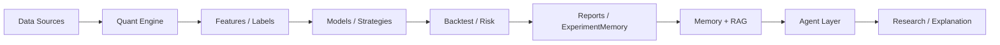

# Quant MAS — Multi-Agent Quantitative Research Platform

> **Resume-ready** open-source platform for AI Agent & Quant research: deterministic pipelines, walk-forward OOS, Memory/RAG, and safe agent orchestration — **not a live-trading bot**.

[](https://github.com/ytq0198/Quant-MAS)
[](https://www.python.org/)
[](docs/progress.md)
[](docs/experiment_log.md)
[](docs/mcp_protocol.md)
[](LICENSE)

---

## Highlights at a glance

| | |
|---|---|
| **361 pytest** | Dual-end verified (local + a6000 server @ `6913dbf`) |
| **OOS Sharpe 0.586** | Paper ML baseline · EXP-20260602-008 · 19 walk-forward windows |
| **M13 complete** | YAML recipes · LangGraph backend · auditable paper export |
| **Safety boundary** | LLM agents orchestrate & explain — they **never** place live orders |

> Quant Engine **computes**. Agent Layer **explains, orchestrates, and reports**.

**Status**: M1–M8 ✅ · v3 M9–M13 ✅ · Next: paper writing (`outputs/paper/`) · optional LoRA / RL research lines

---

## Architecture




Details: [docs/architecture.md](docs/architecture.md) · [docs/index.md](docs/index.md)

---

## What you get

**Quant Engine** — Parquet storage, OHLCV validation, features, MA Cross / LightGBM strategies, backtest, risk, walk-forward OOS

**Agent Layer** — `ToolRegistry`, `SupervisorAgent` (rule routing), `ReportAgent`, `ResearchAgent` (mock-safe · optional local vLLM)

**Memory / RAG** — JSON · SQLite · Postgres · pgvector hybrid retrieval

**Research extensions (v3)**

| Track | Highlight | Key EXP |
|-------|-----------|---------|
| Text signals | FinBERT walk-forward trilogy | WF-003 real Finnhub **0.565** vs **0.586** |
| Population | Candidate → OOS bridge | POP-006 best **1.039** |
| RL | Train → export → OOS ablation | POP-010 **0.387** (vs all-cash **0.0**) |
| M13 orchestration | Scheduler + YAML + LangGraph + paper export | EXP-M13-001→004 |

Paper rule: conclusions use **walk-forward OOS** only — see [docs/research_protocol.md](docs/research_protocol.md).

---

## Quick start

```bash
git clone https://github.com/ytq0198/Quant-MAS.git
cd Quant-MAS

python -m pip install -e .
python -m pytest -v                              # expect 361 passed
python -c "import quant_mas; print('Quant MAS ready')"
```

**Optional extras**

```bash
python -m pip install -r requirements-data.txt
python -m pip install -r requirements-ml.txt
python -m pip install -e ".[orchestration]"      # LangGraph (M13.2)
python -m pip install -e ".[llm]"                # HTTP LLM client
python -m pip install -e ".[text]"               # FinBERT (server)
```

---

## Key CLI examples

<details>
<summary><strong>Walk-forward OOS</strong> (paper baseline)</summary>

```bash
python scripts/run_walk_forward.py \
  --config configs/walk_forward.yaml \
  --storage-config configs/storage.yaml \
  --experiment-name local_walk_forward_demo
```

</details>

<details>
<summary><strong>M13 pipeline</strong> (scheduler or LangGraph)</summary>

```bash
python scripts/run_mcp_pipeline.py --list-recipes
python scripts/run_mcp_pipeline.py --recipe configs/pipelines/ml_baseline.yaml.example --dry-run
python scripts/run_mcp_pipeline.py --backend langgraph \
  --recipe configs/pipelines/text_enhanced.yaml.example --dry-run
```

</details>

<details>
<summary><strong>Paper artifact export</strong> (M13.3)</summary>

```bash
python scripts/export_paper_artifacts.py \
  --memory-path outputs/reports/experiments.json \
  --audit-dir outputs/pipelines \
  --output-dir outputs/paper
```

Produces 6 files: `paper_main_results.csv`, text/population/RL ablation CSVs, `paper_experiment_index.md`, `audit_summary.json`.

</details>

<details>
<summary><strong>ResearchAgent</strong> (mock-safe · server vLLM)</summary>

```bash
python scripts/run_research_agent.py \
  --task "Summarize OOS baseline EXP-20260602-008 (oos.sharpe ≈ 0.586)"
```

Server vLLM: see [docs/server_commands.md](docs/server_commands.md).

</details>

More examples: end-to-end pipeline, LightGBM, candidate OOS batch — in previous README sections and [docs/server_commands.md](docs/server_commands.md).

---

## Experiment snapshot

| Result | Value | Notes |
|--------|-------|-------|
| **ML OOS baseline** | sharpe **0.586** | EXP-20260602-008 |
| **Text (real Finnhub)** | sharpe **0.565** | EXP-TEXT-WF-003 · 2.42% coverage |
| **Population best** | sharpe **1.039** | EXP-POP-006 · rule candidates |
| **RL feature-linear** | sharpe **0.387** | EXP-POP-010 · vs all-cash 0.0 |
| **M13 paper export** | 6 artifacts | EXP-M13-004 · `outputs/paper/` |
| **pytest** | **361 passed** | M13 closeout · dual-end |

Full log: [docs/experiment_log.md](docs/experiment_log.md)

---

## Resume one-liner

> Built **Quant MAS**, a Python 3.11 multi-agent quant research platform with walk-forward OOS (baseline sharpe 0.586), Memory/RAG, Postgres/pgvector, local vLLM ResearchAgent, competitive learning & RL ablation chains, **M13 enterprise orchestration** (YAML recipes, LangGraph, paper export), and **361 passing pytest** — with strict safeguards preventing LLM agents from direct live trading.

中文：见 [项目进度.md](项目进度.md) · [论文初稿.md](论文初稿.md)

---

## Project structure

```text
Quant-MAS/
├── src/quant_mas/       # data, features, models, backtest, agents, memory, rl, orchestration
├── scripts/             # CLI (+ export_paper_artifacts.py, run_mcp_pipeline.py)
├── configs/             # YAML (+ pipelines/*.yaml.example)
├── tests/               # 361 pytest cases
├── docs/                # architecture, progress, server_commands, mcp_protocol
└── 论文初稿.md           # paper draft with embedded export tables
```

---

## Documentation

| Doc | Description |
|-----|-------------|
| [docs/index.md](docs/index.md) | Documentation hub |
| [docs/progress.md](docs/progress.md) | M1–M13 progress (361 pytest) |
| [docs/server_commands.md](docs/server_commands.md) | Server deploy & runbook |
| [docs/mcp_protocol.md](docs/mcp_protocol.md) | M13 orchestration protocol |
| [docs/experiment_log.md](docs/experiment_log.md) | Verified experiments |
| [项目进度.md](项目进度.md) | 中文进度总览 |
| [项目v3设计.md](项目v3设计.md) | v3 design M9–M13 |
| [论文初稿.md](论文初稿.md) | Paper draft |

---

## Roadmap

**Done** — Quant Engine · Walk-forward OOS · Agents · Memory/RAG · M6 text · M7 RL sim · M8 protocol · M9 Postgres/pgvector · M10 vLLM · M11–M11.8 population OOS · M12 RL export/OOS · **M13 orchestration + paper export** · FinBERT WF-001/002/003

**Optional next** — EXP-TEXT-002 LoRA · paper-trading sandbox (simulation only)

---

## Contributing · License · Disclaimer

Contributions welcome — see [CONTRIBUTING.md](CONTRIBUTING.md). [MIT License](LICENSE).

**Research & education only.** Not financial advice. Backtest results may be wrong or overfit.

**Repo**: https://github.com/ytq0198/Quant-MAS · **Email**: [3240101782@zju.edu.cn](mailto:3240101782@zju.edu.cn)
