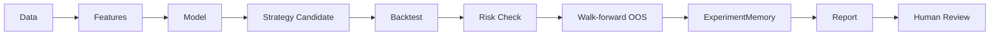
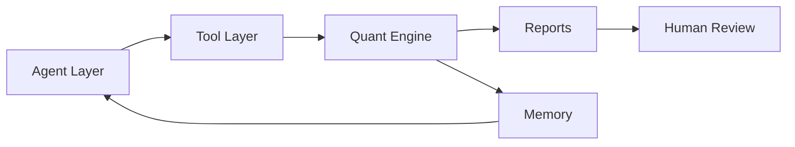

# Quant MAS - Multi-Agent Quantitative Research Platform / 多智能体量化研究平台

> A research-oriented, resume-ready multi-agent quantitative research platform with deterministic quant pipelines, walk-forward OOS evaluation, Memory/RAG, LLM-assisted research agents, auditable workflows, and competitive strategy learning.
>
> 一个面向科研、实习和简历展示的多智能体量化研究平台，集成确定性量化流水线、Walk-forward 样本外评估、Memory/RAG、LLM 辅助研究智能体、可审计工作流和竞争式策略学习。

> **Safety boundary:** This is not a live-trading bot. LLM agents do not place live orders.
>
> **安全边界：** 本项目不是实盘交易机器人，LLM 智能体不直接下单。

[](https://github.com/ytq0198/Quant-MAS)
[](https://www.python.org/)
[](docs/progress.md)
[](docs/experiment_log.md)
[](docs/research_protocol.md)
[](docs/architecture.md)
[](LICENSE)

Quant MAS is designed as a practical learning and interview project for **AI Agent**, **Quant**, and **Financial AI / LLM application** internships. It is meant to be read, run, extended, discussed, and audited.

Quant MAS 适合作为 **AI Agent / Quant / Financial AI** 实习项目练习与简历项目：代码可阅读、可运行、可扩展、可讨论，也强调实验可审计。

---

<a id="table-of-contents"></a>

## Table of Contents / 目录

- [Project Overview / 项目简介](#project-overview)
- [Why This Project / 为什么做这个项目](#why-this-project)
- [Architecture / 系统架构](#architecture)
- [Key Design Principles / 核心设计原则](#key-design-principles)
- [Features / 功能概览](#features)
- [Current Status / 当前进度](#current-status)
- [Quick Start / 快速开始](#quick-start)
- [CLI Examples / 命令示例](#cli-examples)
- [Research Workflow / 研究流程](#research-workflow)
- [Experiment Snapshot / 实验摘要](#experiment-snapshot)
- [Resume Usage / 简历写法](#resume-usage)
- [Project Structure / 项目结构](#project-structure)
- [Documentation / 文档索引](#documentation)
- [Roadmap / 路线图](#roadmap)
- [Contributing / 贡献指南](#contributing)
- [Contact / 联系方式](#contact)
- [Disclaimer / 免责声明](#disclaimer)

---

<a id="project-overview"></a>

## Project Overview / 项目简介

Quant MAS separates deterministic quantitative computation from agentic research orchestration. The Quant Engine handles data ingestion, feature engineering, model training, backtesting, risk checks, and walk-forward OOS evaluation. The Agent Layer handles research planning, tool routing, memory retrieval, interpretation, and report generation.

Quant MAS 将确定性的量化计算与智能体研究编排分离。Quant Engine 负责数据获取、特征工程、模型训练、回测、风控检查和 Walk-forward 样本外评估；Agent Layer 负责研究规划、工具编排、记忆检索、结果解释和报告生成。

This separation keeps the system useful for AI Agent practice without giving the LLM direct control over trading actions. Agents can reason about experiments, call approved tools, and summarize evidence, while quantitative results remain reproducible through code and configuration.

这种分层让项目既适合练习 AI Agent 工程，又不会让 LLM 直接控制交易行为。智能体可以围绕实验进行规划、调用授权工具并总结证据，而量化结果仍由代码和配置保证可复现。

---

<a id="why-this-project"></a>

## Why This Project / 为什么做这个项目

This project is designed for students and developers who want a practical AI Agent + Quant Research project that can be read, run, extended, and discussed in internship interviews.

这个项目适合想找 AI Agent、量化开发、金融 AI 实习的同学，用来练习工程实现、科研实验和简历展示。

It is not a toy demo, not a live-trading bot, and not a claim about automatic profits. It is a reproducible research engineering project that combines deterministic quant modules, LLM-assisted research workflows, Memory/RAG, LangGraph-style orchestration, MCP-style scheduling, and experiment audit logs.

它不是玩具 demo，也不是自动交易机器人，更不是收益承诺；它是一个可复现的研究工程项目，组合了确定性量化模块、LLM 辅助研究流程、Memory/RAG、LangGraph 风格编排、MCP 风格调度和实验审计日志。

For internship preparation, Quant MAS can help demonstrate three kinds of ability: building AI Agent systems, implementing quant research pipelines, and communicating financial AI experiments with appropriate safety boundaries.

对于实习准备，Quant MAS 可以展示三类能力：构建 AI Agent 系统、实现量化研究流水线，以及在清晰安全边界下表达金融 AI 实验。

---

<a id="architecture"></a>

## Architecture / 系统架构


| Layer | English | 中文 |
|---|---|---|
| 1. Data Layer | Provides OHLCV data, multi-source fetchers such as Stooq, YFinance, Finnhub, and Alpha Vantage, macro/filing sources such as FRED and SEC EDGAR, text news, and Parquet/JSONL storage. | 提供 OHLCV 价格与成交量数据，Stooq、YFinance、Finnhub、Alpha Vantage 等多源抓取器，FRED 与 SEC EDGAR 等宏观/财报来源，文本新闻，以及 Parquet/JSONL 存储。 |
| 2. Quant Engine Layer | Performs deterministic computation through data validation, feature engineering, models, strategies, backtest engine, walk-forward OOS evaluation, and risk layer. | 通过数据校验、特征工程、模型、策略、回测引擎、Walk-forward 样本外评估和风险层执行确定性计算。 |
| 3. Research / Experiment Layer | Stores experiment memory, registers baselines, compares experiments, exports paper artifacts, and keeps metric families separated. | 存储实验记忆、注册基线、对比实验、导出论文产物，并保持不同指标族分离。 |
| 4. Memory / RAG Layer | Loads documents, retrieves context with simple and hybrid retrievers, creates hash embeddings, and supports in-memory vector store, optional pgvector, and optional Neo4j. | 加载文档，使用简单检索器和混合检索器获取上下文，生成哈希嵌入，并支持内存向量库、可选 pgvector 和可选 Neo4j。 |
| 5. Tool Layer | Exposes controlled tools such as DataSummaryTool, BacktestTool, TrainModelTool, ReportTool, RiskTool, MLBacktestTool, and PipelineTool. | 暴露受控工具，包括 DataSummaryTool、BacktestTool、TrainModelTool、ReportTool、RiskTool、MLBacktestTool 和 PipelineTool。 |
| 6. Agent Layer | Uses SupervisorAgent, ResearchAgent, ReportAgent, MockLLMClient, optional DeepSeek/local vLLM, and ToolRegistry for planning, explanation, routing, and report generation. | 使用 SupervisorAgent、ResearchAgent、ReportAgent、MockLLMClient、可选 DeepSeek/local vLLM 和 ToolRegistry 完成规划、解释、路由和报告生成。 |
| 7. Orchestration / Protocol Layer | Coordinates M4 research workflow, M13 MCP scheduler, YAML pipeline recipes, optional LangGraph backend, Audit JSONL, agent communication, and ToolPolicy. | 协调 M4 研究工作流、M13 MCP 调度器、YAML 流水线配方、可选 LangGraph 后端、Audit JSONL、智能体通信和 ToolPolicy。 |
| 8. Outputs / Human Review | Produces backtest reports, walk-forward reports, paper tables, audit logs, experiment index, human confirmation records, and a clear no direct live trading boundary. | 产出回测报告、滚动样本外报告、论文表格、审计日志、实验索引、人工确认记录，并明确不进行任何直接实盘交易。 |

The safety boundary is part of the architecture, not an afterthought. LLM agents cannot directly place live orders; only audited OOS metrics can support paper conclusions; all trading candidates require backtesting, risk checks, audit logs, and human confirmation.

安全边界是架构的一部分，而不是事后补充。LLM 智能体不能直接下实盘订单；只有经过审计的样本外指标可以支撑论文结论；所有交易候选都需要经过回测、风控检查、审计日志和人工确认。

Metrics are intentionally separated: `oos.*` is paper-grade, while `simulation.*`, `training.*`, `population.*`, and `audit.*` describe different experiment contexts and must not be mixed.

指标被有意分离：`oos.*` 属于论文级样本外指标，而 `simulation.*`、`training.*`、`population.*` 和 `audit.*` 描述不同实验上下文，不能混用。

By default, the system does not expose an external MCP listener. ToolPolicy also denies shell, broker, order, secrets, and other unsafe execution paths.

默认情况下，系统不开放外部 MCP 监听器。ToolPolicy 也会拒绝 shell、broker、order、secrets 等不安全执行路径。

---

<a id="key-design-principles"></a>

## Key Design Principles / 核心设计原则

- LLM agents do not trade directly.
- LLM 智能体不直接交易。

- Quant Engine performs deterministic computation.
- Quant Engine 执行确定性计算。

- Agents plan, explain, route tools, retrieve memory, and generate reports.
- 智能体负责规划、解释、工具路由、记忆检索和报告生成。

- All trading candidates must pass backtesting, risk checks, audit logs, and human confirmation.
- 所有交易候选都必须经过回测、风控检查、审计日志和人工确认。

- Walk-forward OOS is the paper-grade evaluation metric.
- Walk-forward 样本外评估是论文级评估指标。

- `simulation.*`, `training.*`, `population.*`, and `audit.*` metrics must not be mixed with `oos.*` metrics.
- `simulation.*`、`training.*`、`population.*` 和 `audit.*` 指标不能与 `oos.*` 指标混用。

---

<a id="features"></a>

## Features / 功能概览

| Category | English | 中文 |
|---|---|---|
| Data ingestion | Config-driven data fetching, loading, validation, cataloging, and local storage. | 基于配置的数据获取、加载、校验、目录管理和本地存储。 |
| Feature engineering | Technical indicators, labels, text signal integration, and feature pipelines. | 技术指标、标签、文本信号集成和特征流水线。 |
| Backtesting | Deterministic strategy backtesting with metrics and report generation. | 确定性策略回测，支持指标计算和报告生成。 |
| ML training | Model training utilities including LightGBM-oriented workflows. | 模型训练工具，包含面向 LightGBM 的训练流程。 |
| Walk-forward OOS | Out-of-sample evaluation workflow for paper-grade baseline comparison. | 面向论文级基线对比的 Walk-forward 样本外评估流程。 |
| Risk control | Exposure, drawdown, limit, and decision-oriented risk modules. | 仓位、回撤、限制和决策相关的风险控制模块。 |
| Experiment memory | ExperimentMemory records baselines, candidates, metrics, and artifacts. | ExperimentMemory 记录基线、候选、指标和实验产物。 |
| Memory/RAG | Document loading, chunking, embedding, vector search, hybrid retrieval, and memory stores. | 文档加载、切分、嵌入、向量搜索、混合检索和记忆存储。 |
| ResearchAgent / SupervisorAgent | Agents plan research tasks, route tools, summarize results, and coordinate workflows. | 智能体负责研究规划、工具路由、结果总结和工作流协调。 |
| LangGraph workflow | Optional LangGraph-style workflow backend for research orchestration. | 可选的 LangGraph 风格工作流后端，用于研究编排。 |
| LLM client | Supports mock clients by default, plus DeepSeek or local vLLM through compatible configuration when available. | 默认支持 Mock 客户端，也可在配置可用时接入 DeepSeek 或本地 vLLM。 |
| Text signal | Supports text records, text model experiments, and text-enhanced feature workflows. | 支持文本记录、文本模型实验和文本增强特征流程。 |
| Population / competitive strategy learning | Supports candidate populations and competitive strategy learning experiments. | 支持候选策略种群和竞争式策略学习实验。 |
| RL simulation | Provides reinforcement-learning-oriented trading environment, training loop, and policy export experiments. | 提供面向强化学习的交易环境、训练循环和策略导出实验。 |
| MCP-style scheduler and audit logs | Provides scheduler, tool policy, recipe execution, and auditable workflow event logs. | 提供调度器、工具策略、配方执行和可审计工作流事件日志。 |
| Paper artifact export | Exports experiment tables and audit summaries for research writing. | 导出实验表格和审计摘要，服务论文写作。 |

---

<a id="current-status"></a>

## Current Status / 当前进度

| Stage | Status | Notes |
|---|---|---|
| v1 Prompt 1-20 | Complete | Main deterministic quant pipeline completed. |
| v1 Prompt 1-20 | 已完成 | 主要确定性量化链路已完成。 |
| Plus v2 M1-M8 | Complete | Research platform extensions completed. |
| Plus v2 M1-M8 | 已完成 | 研究平台扩展已收官。 |
| v3 M9-M13 | Complete | Enterprise-style research system extensions completed. |
| v3 M9-M13 | 已完成 | 企业风格研究系统扩展已完成。 |
| Test baseline | 361 passed | Current pytest baseline reported by project progress. |
| 测试基线 | 361 passed | 当前项目进度记录的 pytest 基线。 |
| Important OOS baseline | EXP-20260602-008 | Walk-forward OOS Sharpe = 0.586. |
| 重要样本外基线 | EXP-20260602-008 | Walk-forward OOS Sharpe = 0.586。 |
| M13 orchestration and paper export | Complete | MCP-style scheduler, recipe workflow, LangGraph backend, and paper artifact export completed. |
| M13 编排与论文导出 | 已完成 | MCP 风格调度、配方工作流、LangGraph 后端和论文产物导出已完成。 |

This project is still evolving. Feedback, issues, discussions, and PRs are welcome.

项目仍在持续演进。欢迎交流、Issue、Discussion、PR，也欢迎 Star / Fork。

---

<a id="quick-start"></a>

## Quick Start / 快速开始

```bash
git clone https://github.com/ytq0198/Quant-MAS.git
cd Quant-MAS

python -m pip install -e .
python -m pytest -v
python -c "import quant_mas; print('Quant MAS ready')"
```

The default test path is designed to avoid real network calls and real LLM API calls unless optional integrations are explicitly configured.

默认测试路径不依赖真实网络请求或真实 LLM API 调用；只有在显式配置可选集成时，才会连接外部服务。

Optional dependency groups are available through `pyproject.toml`, such as `data`, `ml`, `orchestration`, `llm`, `text`, and `rl`.

`pyproject.toml` 中提供了可选依赖组，例如 `data`、`ml`、`orchestration`、`llm`、`text` 和 `rl`。

```bash
python -m pip install -e ".[data]"
python -m pip install -e ".[ml]"
python -m pip install -e ".[orchestration]"
python -m pip install -e ".[llm]"
python -m pip install -e ".[text]"
python -m pip install -e ".[rl]"
```

---

<a id="cli-examples"></a>

## CLI Examples / 命令示例

```bash
python scripts/run_pipeline.py --config configs/data.yaml
```

Run the basic data and feature pipeline.

运行基础数据与特征流水线。

```bash
python scripts/run_backtest.py --config configs/backtest.yaml
```

Run a deterministic backtest from configuration.

根据配置运行确定性回测。

```bash
python scripts/train_model.py --config configs/train.yaml
```

Train an ML model using the configured training workflow.

使用配置化训练流程训练机器学习模型。

```bash
python scripts/run_walk_forward.py --config configs/walk_forward.yaml
```

Run walk-forward OOS evaluation for research-grade comparison.

运行 Walk-forward 样本外评估，用于研究级对比。

```bash
python scripts/run_agent.py --config configs/agent.yaml
```

Run the basic agent workflow with controlled tool access.

运行基础智能体流程，并通过受控工具访问量化能力。

```bash
python scripts/run_research_agent.py --task "Summarize the OOS baseline and safety boundary."
```

Ask the ResearchAgent to summarize experiment context and safety constraints.

让 ResearchAgent 总结实验上下文和安全约束。

```bash
python scripts/run_competitive_experiment.py --config configs/competitive.yaml
```

Run a competitive strategy learning experiment.

运行竞争式策略学习实验。

```bash
python scripts/export_paper_artifacts.py --memory-path outputs/reports/experiments.json --audit-dir outputs/pipelines --output-dir outputs/paper
```

Export paper-oriented experiment tables and audit summaries.

导出面向论文写作的实验表格和审计摘要。

---

<a id="research-workflow"></a>

## Research Workflow / 研究流程



The research workflow moves from data to features, model, candidate strategy, backtest, risk check, walk-forward OOS, experiment memory, report generation, and human review.

研究流程从数据出发，经过特征、模型、候选策略、回测、风控检查、Walk-forward 样本外评估、实验记忆、报告生成，最后进入人工审查。



Agents do not compute metrics by themselves. They call tools, tools invoke the Quant Engine, and outputs are stored in reports and memory for later review.

智能体不自行计算指标。它们调用工具，工具再调用 Quant Engine；输出结果进入报告和记忆，供后续审查。

---

<a id="experiment-snapshot"></a>

## Experiment Snapshot / 实验摘要

| Item | English | 中文 |
|---|---|---|
| Main OOS baseline | `EXP-20260602-008`, Walk-forward OOS Sharpe = `0.586`. | 主要样本外基线为 `EXP-20260602-008`，Walk-forward OOS Sharpe = `0.586`。 |
| Test baseline | Current project baseline reports `361 passed`. | 当前项目测试基线记录为 `361 passed`。 |
| Evaluation rule | Paper-grade evaluation must use walk-forward OOS. | 论文级评估必须使用 Walk-forward 样本外结果。 |
| Metric separation | Single-run ML backtest, simulation, population, RL, training, and audit metrics are not equivalent to `oos.*`. | 单次 ML 回测、simulation、population、RL、training 和 audit 指标不等价于 `oos.*`。 |
| Comparison workflow | New experiments should be compared through `BaselineRegistry` and `compare_experiments.py`. | 新实验应通过 `BaselineRegistry` 和 `compare_experiments.py` 进行对比。 |

The OOS Sharpe value above is a research baseline, not a return promise, trading signal, or live-trading claim.

上面的 OOS Sharpe 是研究基线，不是收益承诺、交易信号或实盘能力声明。

---

<a id="resume-usage"></a>

## Resume Usage / 简历写法

**General English version**

Built a multi-agent quantitative research platform integrating deterministic quant pipelines, walk-forward OOS evaluation, Memory/RAG, LLM-assisted research agents, auditable MCP-style workflows, and competitive strategy population experiments.

**通用中文版本**

基于 Python 构建多智能体量化研究平台，完成数据获取、特征工程、回测、LightGBM 训练、Walk-forward 样本外评估、Memory/RAG、LLM 辅助研究智能体、可审计工作流和竞争式策略种群实验。

**AI Agent Internship**

Built a research-agent workflow with tool routing, Memory/RAG retrieval, supervisor-style orchestration, mock-safe LLM clients, LangGraph-style workflow support, and audit logs for reproducible research tasks.

面向 AI Agent 实习：实现研究智能体工作流，支持工具路由、Memory/RAG 检索、Supervisor 风格编排、默认安全的 Mock LLM 客户端、LangGraph 风格工作流和可复现实验审计日志。

**Quant Developer Internship**

Implemented deterministic quant research modules covering data validation, feature pipelines, ML training, strategy backtesting, risk checks, walk-forward OOS evaluation, and baseline comparison.

面向 Quant Developer 实习：实现确定性量化研究模块，覆盖数据校验、特征流水线、机器学习训练、策略回测、风控检查、Walk-forward 样本外评估和基线对比。

**Financial AI / LLM Application Internship**

Integrated LLM-assisted research agents with controlled quant tools, experiment memory, document retrieval, report generation, and safety rules that prevent direct live-order placement by agents.

面向 Financial AI / LLM 应用实习：将 LLM 辅助研究智能体与受控量化工具、实验记忆、文档检索、报告生成和安全规则结合，明确禁止智能体直接实盘下单。

---

<a id="project-structure"></a>

## Project Structure / 项目结构

```text
src/quant_mas/
|-- data/
|-- features/
|-- models/
|-- strategies/
|-- backtest/
|-- risk/
|-- agents/
|-- tools/
|-- memory/
|-- rag/
|-- context/
|-- rl/
|-- protocols/
|-- orchestration/
`-- research/
```

The structure separates quant computation, agent workflows, memory/RAG, protocols, orchestration, and research artifacts into readable modules.

该结构将量化计算、智能体工作流、Memory/RAG、协议、编排和研究产物拆分为清晰模块。

---

<a id="documentation"></a>

## Documentation / 文档索引

| Document | English | 中文 |
|---|---|---|
| [docs/index.md](docs/index.md) | Documentation hub for the project. | 项目文档总入口。 |
| [docs/progress.md](docs/progress.md) | Tracks completed milestones and current progress. | 记录已完成里程碑和当前进度。 |
| [docs/architecture.md](docs/architecture.md) | Explains the system architecture and module boundaries. | 解释系统架构和模块边界。 |
| [docs/experiment_log.md](docs/experiment_log.md) | Records experiment IDs, baselines, comparisons, and notes. | 记录实验 ID、基线、对比和说明。 |
| [docs/research_protocol.md](docs/research_protocol.md) | Defines research evaluation rules, especially OOS usage. | 定义研究评估规则，尤其是样本外评估使用方式。 |
| [docs/mcp_protocol.md](docs/mcp_protocol.md) | Describes MCP-style scheduling, policy, and audit design. | 描述 MCP 风格调度、策略和审计设计。 |
| [docs/server_commands.md](docs/server_commands.md) | Provides server-side run commands and operational notes. | 提供服务器运行命令和操作说明。 |
| [项目v3设计.md](项目v3设计.md) | Records the v3 design plan and milestone intent. | 记录 v3 设计方案和里程碑意图。 |

---

<a id="roadmap"></a>

## Roadmap / 路线图

**Completed / 已完成**

- v1 Quant MVP: deterministic quant pipeline, backtesting, risk checks, and core CLI workflows.
- v1 Quant MVP：确定性量化流水线、回测、风控检查和核心命令行流程。

- v2 Research Platform: experiment memory, Memory/RAG, agents, workflow extensions, and protocol-style foundations.
- v2 Research Platform：实验记忆、Memory/RAG、智能体、工作流扩展和协议风格基础。

- v3 Enterprise-style Research System: orchestration, MCP-style scheduler, LangGraph-style backend, audit logs, and paper artifact export.
- v3 Enterprise-style Research System：编排、MCP 风格调度、LangGraph 风格后端、审计日志和论文产物导出。

**Next / 下一步**

- Paper writing and clearer research narrative.
- 论文写作与更清晰的研究叙事。

- More real-data reproduction and benchmark comparison.
- 更多真实数据复现和基准对比。

- Stronger text signal experiments.
- 更强的文本信号实验。

- Optional LoRA experiments.
- 可选 LoRA 实验。

- Optional RL robustness study.
- 可选 RL 鲁棒性研究。

- More community-friendly examples and onboarding docs.
- 更多适合社区使用的示例和入门文档。

---

<a id="contributing"></a>

## Contributing / 贡献指南

Issues, discussions, PRs, suggestions, and criticism are welcome.

欢迎 Issue、讨论、PR、建议，也非常欢迎大家指出问题。

- Do not commit API keys.
- 不要提交 API keys。

- Do not commit large datasets or model weights.
- 不要提交大型数据集或模型权重。

- Tests should not depend on real network or real LLM API by default.
- 默认测试不应依赖真实网络或真实 LLM API。

- Please keep experiment claims reproducible and distinguish `oos.*` from simulation, training, population, and audit metrics.
- 请保持实验结论可复现，并区分 `oos.*` 与 simulation、training、population、audit 等指标。

---

<a id="contact"></a>

## Contact / 联系方式

If you are also learning AI agents, quantitative research, RAG, or financial AI, feel free to open an issue or contact me. Feedback from experienced researchers and engineers is especially welcome.

如果你也在学习 AI Agent、量化研究、RAG 或金融 AI，欢迎提 Issue 或邮件交流。也非常欢迎有经验的前辈和工程师批评指正。

- Email: [3240101782@zju.edu.cn](mailto:3240101782@zju.edu.cn)
- GitHub: [https://github.com/ytq0198/Quant-MAS](https://github.com/ytq0198/Quant-MAS)

---

<a id="disclaimer"></a>

## Disclaimer / 免责声明

This project is for research and educational purposes only. It is not financial advice. It should not be used for live trading without independent validation, risk control, audit, and human approval.

本项目仅用于研究和教育目的，不构成投资建议。未经独立验证、风控、审计和人工确认，不应直接用于实盘交易。

LLM agents in this project are designed for planning, explanation, retrieval, routing, and reporting. They are not designed to directly place live orders.

本项目中的 LLM 智能体用于规划、解释、检索、路由和报告生成，不用于直接实盘下单。
