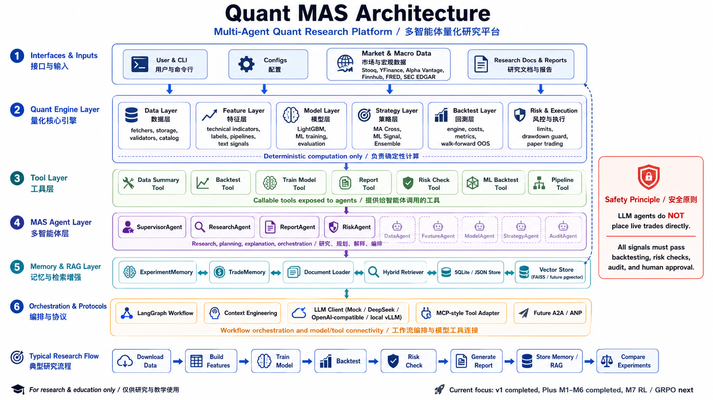

# Quant MAS 架构

更新时间：2026-06-01（**Plus v2 收官** — M7 RL + M8 Protocol Layer）

Quant MAS 采用「确定性量化引擎 + **Text Signal Layer（M6）** + **RL Simulation Layer（M7）** + 轻量 Agent 编排 + Context Layer（M5） + Memory/RAG v2 + Research 基线层」架构。Agent 不替代回测、训练、风控和执行，也不允许直接实盘下单。

## 核心边界

- **Quant Engine Layer**：确定性计算（数据、特征、模型、策略、回测、风控）。
- **Tool Layer**：将引擎能力封装为 Agent 可调用工具。
- **Agent Layer**：规则路由、编排、报告和解释；**M5** 可选真实 LLM（默认 Mock，仅研究/报告）。
- **Text Signal Layer（Plus M6）**：`FinancialTextRecord` → sentiment signal → `merge_text_signals_into_features`；**不替代** LightGBM，pytest 用 Mock 分类器。
- **RL Simulation Layer（Plus M7）**：`TradingEnv` + baseline policies + GRPO-style ranking；**simulation only**，metrics 为 `simulation.*`，**不替代** walk-forward OOS。
- **Protocol Layer（Plus M8）**：MCP-style tool spec + `ToolPolicy` + AgentCard 导出；**不接**外部 MCP server，**不**新增 broker/shell。
- **Context Layer（Plus M5）**：`ContextBuilder` → `AgentContextBundle`；事实 metrics 与 LLM 叙事分离。
- **Memory Layer（Plus M3）**：可插拔 `MemoryStore`（JSON / SQLite）；`ExperimentMemory` 仍可用
- **RAG Layer（Plus M3）**：`SimpleRetriever`（关键词）+ `HybridRetriever`（关键词 + 向量）；`HashEmbeddingClient` / `InMemoryVectorStore` 默认
- **Research Layer（Plus M1）**：实验基线注册、指标汇总、跨实验比较；**后续实验须与 EXP-20260602-008 OOS baseline 对比**。
- LLM Agent **不允许**直接实盘下单。
- 所有交易信号须经过回测、风控、审计和人工确认。

## 架构图（Architecture Diagram）



> **说明**：架构图见仓库根目录 [`architecture.png`](../architecture.png)。下方为文本树补充说明。

## 当前架构图（文本树）

```text
Quant MAS
├── Quant Engine Layer
│   ├── data          ParquetStorage, DataCatalog, fetchers/（M2 子包）, validate_ohlcv
│   ├── features      technical, labels, text_signals（M6）, build_feature_table
│   ├── strategies    MovingAverageCrossStrategy, MLSignalStrategy
│   ├── backtest      BacktestEngine, walk_forward, metrics, report
│   ├── models        LightGBMDirectionModel, time-series helpers
│   ├── risk          RiskLimits, exposure, drawdown_guard
│   ├── utils         device.py（GPU/CUDA）
│   └── pipeline      run_quant_pipeline
│
├── Tool Layer（7 tools）
│   data_summary | backtest | train_model | report
│   risk_check | ml_backtest | pipeline
│
├── Agent Layer
│   Message, MockLLMClient, OpenAICompatibleLLMClient, resolve_llm_client
│   BaseAgent, ReportAgent, ResearchAgent（M5）
│   SupervisorAgent（规则路由）, AgentEvent 系列
│
├── Text Layer（Plus M6）
│   text/             data_schema, dataset, mock_classifier, finbert_baseline, lora_finetune
│   train_text_model.py  --mode mock|finbert_baseline|lora
│
├── RL Simulation Layer（Plus M7）
│   rl/               env_schema, trading_env, reward, baseline_policy, grpo_experiment, mock_data
│   run_rl_baseline.py   --policy random|buy_hold|ml_copy（simulation_only）
│
├── Protocol Layer（Plus M8）
│   protocols/mcp/    types, policy, adapter
│   protocols/a2a/    agent_card
│   export_agent_cards.py
│
├── Context Layer（Plus M5）
│   context_schema, context_builder, compression
│   configs/context.yaml, configs/llm.yaml
│   run_research_agent.py（**不替换** Supervisor）
│
├── Orchestration Layer（Plus M4）
│   ResearchWorkflow — sequential / 可选 LangGraph
│   QuantWorkflowState, 6 节点 DAG（dry-run 默认）
│   run_langgraph_workflow.py（**不替换** Supervisor）
│
├── Memory Layer（Plus M3）
│   MemoryStore 抽象 → JsonMemoryStore | SqliteMemoryStore
│   ExperimentMemory（兼容）, TradeMemory（JSONL 空壳）
│   factory + configs/memory.yaml
│
├── RAG Layer（Plus M3）
│   document_loader, SimpleRetriever（保留）
│   HashEmbeddingClient, InMemoryVectorStore, HybridRetriever
│   index_documents.py / query_memory.py
│
└── Research Layer（Plus M1）
    baseline.py          BaselineRun, BaselineRegistry
    metrics_table.py     collect_experiment_metrics, build_comparison_table
    compare_experiments.py   CLI → comparison.csv / comparison.md
    research_protocol.md     实验规范与 OOS 主指标定义
```

## CLI 入口

```text
download_data.py      数据下载（yfinance / Stooq）
merge_parquet.py      合并分年 parquet
build_features.py     特征构建
run_backtest.py       均线策略回测
train_model.py        模型训练（--device auto/cpu/gpu/cuda）
run_ml_backtest.py    ML 信号回测
run_walk_forward.py   Walk-forward 样本外
compare_experiments.py  实验比较表（ExperimentMemory → CSV/MD）
index_documents.py      文档切块 + 向量索引（Plus M3）
query_memory.py         实验查询 + RAG 检索（Plus M3）
generate_report.py    报告读取/生成（--use-llm 可选，M5）
run_research_agent.py  ResearchAgent + ContextBuilder（M5）
run_agent.py          Supervisor 规则路由
run_langgraph_workflow.py  ResearchWorkflow DAG（Plus M4，dry-run）
run_rl_baseline.py      RL 模拟 baseline rollouts（Plus M7，--dry-run）
export_agent_cards.py   MCP specs + A2A AgentCard JSON（Plus M8）
run_pipeline.py       端到端 pipeline
```

## 模块说明

### Quant Engine

| 模块 | 要点 |
|------|------|
| 数据 | Stooq 服务器已验证（EXP-20260601-004）；yfinance 易限流 |
| 回测 | 下一根 bar 成交；commission / slippage |
| ML | Prompt 15 完整 artifacts；GPU/CUDA（M-010） |
| Walk-forward | OOS sharpe **0.586**（EXP-20260602-008） |
| 风控 | 策略只产出 target_weight；风控 clip/reject |

### Tool Layer

工具返回 **摘要 + metrics + 路径**，不返回完整 DataFrame。

### Agent Layer

SupervisorAgent 7 类路由（更具体规则优先，如 ml_backtest 先于 backtest）：

| 关键词示例 | 工具 |
|------------|------|
| ML回测 / ml backtest | ml_backtest |
| 风控 / risk | risk_check |
| 全流程 / pipeline | pipeline |
| 回测 / backtest | backtest |
| 训练 / train | train_model |
| 报告 / report | report |
| 数据 / data | data_summary |

### Memory / RAG

- **ExperimentMemory**：add / list / latest / get / search_by_name / sort_by_metric / find_best
- **TradeMemory**：append-only JSONL（Plus M7 模拟预留）
- **SimpleRetriever**：从 docs/、outputs/reports/ 关键词检索

### Research Layer（Plus M1）

| 组件 | 职责 |
|------|------|
| **BaselineRegistry** | 注册命名 baseline（`BaselineRun`）；`compare_runs()`、`get_best("oos.sharpe")` |
| **MetricsTable** | 从 `ExperimentRecord` 抽取指标 → `build_comparison_table()` |
| **compare_experiments.py** | CLI：读 ExperimentMemory → 写 `outputs/research/comparison.csv` 与 `comparison.md` |
| **research_protocol.md** | 必填实验字段；**论文主指标 = Walk-forward OOS** |

**数据流：**

```text
run_* / train_* / walk_forward
        ↓
ExperimentMemory（metrics 含嵌套 oos.*）
        ↓
collect_experiment_metrics → BaselineRegistry / comparison table
        ↓
与 EXP-20260602-008（OOS sharpe 0.586）对照 → docs/experiment_log.md
```

**比较族（family）**：`ma_cross` | `lightgbm` | `ml_backtest` | `walk_forward` | `other`

**OOS 主 baseline**：EXP-20260602-008，`oos.sharpe = 0.586`。单段 ML 回测（ml_backtest family）**不可**替代 OOS 结论。

## 测试与部署

- **pytest**：本地 + 服务器 **212 passed**（EXP-027/028）
- **服务器**：`/mnt/localDisk3/weizian/Quant-MAS`，conda `quant-mas`，Python 3.11.15
- **GitHub**：https://github.com/ytq0198/Quant-MAS

## 后续计划（Plus v2）

| 模块 | 内容 | 状态 |
|------|------|------|
| **M1** 研究基线 | BaselineRegistry、compare_experiments | ✅ EXP-20260602-009/010 |
| **M2** 数据扩展 | 多数据源 fetcher + registry | ✅ EXP-20260602-011/012，EXP-DATA-001 |
| **M3** Memory/RAG v2 | SQLite / 向量 / HybridRetriever | ✅ 本地（EXP-20260602-013） |
| **M4** LangGraph | ResearchWorkflow DAG | ✅ EXP-20260602-015/016 |
| **M5** 上下文/LLM | ContextBuilder、ResearchAgent | ✅ 本地+服务器（EXP-017/018，EXP-LLM-001） |
| **M6** 文本大模型 | FinBERT/LoRA + text_signals merge | ✅ EXP-019/020 + **EXP-TEXT-001/WF-001** |
| **M7** RL/GRPO 模拟 | TradingEnv + GRPO ranking | ✅ EXP-021/022（180 passed） |
| **M8** MCP/A2A | MCP adapter + AgentCard | ✅ EXP-023/024（195 passed） |
| **M9** 企业 DB | Postgres + pgvector + Neo4j | ✅ EXP-025/028（212 passed 服务器） |
| **M10** LLM 生产化 | local_vllm + ResearchAgent | ✅ EXP-027/028/LLM-002（212 passed + vLLM smoke） |

详见 [项目plus设计.md](../项目plus设计.md)。**Plus v2 系统结构定稿**见 [`项目进度.md`](../项目进度.md) §Plus v2 收官。
