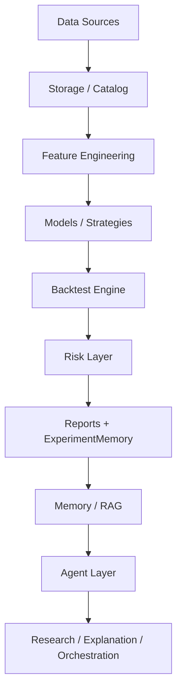

# Quant MAS Documentation / 项目文档

**Research-first multi-agent quantitative platform · 多智能体量化研究平台**  
**Release**: [v0.1.0](https://github.com/ytq0198/Quant-MAS/releases/tag/v0.1.0) · **Tests**: 161 passed · **GitHub**: [ytq0198/Quant-MAS](https://github.com/ytq0198/Quant-MAS)

> Documentation hub for students, researchers, and contributors.  
> 面向学生、科研者与贡献者的文档入口，与 [README](../README.md) 结构对应。

---

## 目录 / Table of Contents

- [愿景 / Vision](#愿景--vision)
- [架构 / Architecture](#架构--architecture)
- [分层能力 / Layers](#分层能力--layers)
- [Agent 设计 / Agent Design](#agent-设计--agent-design)
- [Quant Engine](#quant-engine)
- [Memory & RAG](#memory--rag)
- [实验结果 / Results](#实验结果--results)
- [学习路线 / Learning Path](#学习路线--learning-path)
- [适用人群 / Who Is This For](#适用人群--who-is-this-for)
- [常用命令 / Key Commands](#常用命令--key-commands)
- [文档索引 / Doc Index](#文档索引--doc-index)
- [贡献 & 联系 / Contributing](#贡献--联系--contributing)
- [免责声明 / Disclaimer](#免责声明--disclaimer)

---

## 愿景 / Vision

Quant MAS combines a **deterministic Quant Engine** with a **lightweight Agent Layer** and **Memory/RAG** — safely, without LLM direct order placement.

核心原则：

> **Quant Engine computes. Agent Layer explains, orchestrates, and reports.**  
> Quant Engine 负责确定性计算；Agent Layer 负责研究、规划、解释、报告和工具编排。

LLM agents **must not** place live orders. Signals require backtesting, risk checks, audit, and human confirmation.

**Plus v2**：M1–M6 ✅ · M7 RL / M8 MCP 📋 planned · 详见 [progress.md](progress.md)

---

## 架构 / Architecture


<details>
<summary>Mermaid / 流程图（点击展开）</summary>



</details>

Deep dive: [architecture.md](architecture.md) · [项目plus设计.md](../项目plus设计.md)

---

## 分层能力 / Layers

| Layer | English | 中文 | Status |
|-------|---------|------|--------|
| Quant Engine | Data, features, strategies, backtest, risk, metrics | 数据、特征、策略、回测、风控 | ✅ |
| Tool Layer | 7 Quant Tools via `ToolRegistry` | 七大量化工具 | ✅ |
| Agent Layer | SupervisorAgent, ReportAgent, ResearchAgent | 监督 / 报告 / 研究智能体 | ✅ |
| Memory | JSON & SQLite experiment stores | 实验记忆 | ✅ |
| RAG | Keyword + hash vector + hybrid retrieval | 混合检索 | ✅ |
| Orchestration | Sequential + optional LangGraph DAG | 工作流编排 | ✅ |
| Context / LLM | ContextBuilder, mock-safe LLM client | 上下文与可选 LLM | ✅ |
| Text Signals | Mock / FinBERT / LoRA skeleton | 文本特征骨架 | ✅ M6 |
| Research | Baseline registry, compare CLI | 实验基线与对比 | ✅ M1 |
| RL / MCP | Simulation & protocol adapters | 强化学习 / 协议 | 📋 M7/M8 |

---

## Agent 设计 / Agent Design

Lightweight agents — no heavy framework lock-in.

**Implemented / 已实现**

| Agent | Role | 说明 |
|-------|------|------|
| **SupervisorAgent** | Rule-based routing to 7 tools | 中英文关键词路由，不调用真实 LLM |
| **ReportAgent** | Report narrative via LLM boundary | 默认 Mock；可选 OpenAI-compatible API |
| **ResearchAgent** | Context + RAG → hypotheses & summary | 不修改 metrics，不下单 |

**Workflow paths / 工作流路径**

1. **Supervisor + Tools** — `run_agent.py --task "..."`
2. **ResearchWorkflow DAG** — 6 nodes: download → features → train → ml_backtest → risk → report ([langgraph_workflow.md](langgraph_workflow.md))
3. **ResearchAgent** — `run_research_agent.py` + ContextBuilder ([context_engineering.md](context_engineering.md))

**Safety / 安全规则**

- Agents do not place live orders / Agent 不直接下单
- Agents do not overwrite Quant Engine metrics / 不篡改引擎 metrics
- LLM output = narrative, not ground truth / LLM 输出为叙事，非事实测量
- Tests use Mock only / pytest 仅 Mock

---

## Quant Engine

Deterministic pipeline:

- Parquet storage & YAML `DataCatalog`
- OHLCV validation; fetchers (Stooq, yfinance, Alpha Vantage, FRED, …)
- Technical features, future labels, **text_signals merge** (M6)
- `MovingAverageCrossStrategy`, `MLSignalStrategy`
- `BacktestEngine` — next-bar execution
- Risk: position limits, drawdown guard
- **Walk-forward OOS** — paper metric discipline

Research discipline / 科研纪律：

- No random time-series split / 禁止随机切分
- No label leakage / 禁止 label 泄露
- No future text leakage / 禁止未来文本泄漏
- Paper metric = **walk-forward OOS** only / 论文主指标仅 OOS

See [research_protocol.md](research_protocol.md)

---

## Memory & RAG

| Component | Description |
|-----------|-------------|
| `ExperimentMemory` | JSON + SQLite backends |
| `TradeMemory` | Append-only stub |
| `SimpleRetriever` | Keyword search |
| `HybridRetriever` | Keyword + vector merge |
| CLI | `index_documents.py`, `query_memory.py` |

```bash
python scripts/query_memory.py --help
python scripts/index_documents.py --help
python scripts/run_research_agent.py --task "Explain walk-forward OOS baseline"
```

Memory/RAG feeds **ResearchAgent** context — it does not execute trades.

---

## 实验结果 / Results

| Metric | Value | Experiment |
|--------|-------|------------|
| pytest | **161 passed** | EXP-019/020 |
| **OOS sharpe (baseline)** | **0.586** | EXP-20260602-008 |
| **OOS + FinBERT text** | **0.563** | EXP-TEXT-WF-001 · exploratory (200/6033 coverage) |
| Single-segment ML sharpe | 2.78 | ⚠️ in-sample only |
| DeepSeek ResearchAgent smoke | verified | EXP-LLM-001 |
| FinBERT text smoke (server) | 200 signals | EXP-TEXT-001 · ModelScope local path |

⚠️ Single-run backtest ≠ paper evidence. Always compare via `compare_experiments.py`.

详细记录：[experiment_log.md](experiment_log.md) · [progress.md](progress.md)

---

## 学习路线 / Learning Path

1. [README](../README.md) — overview & Quick Start  
2. [architecture.md](architecture.md) — layers & CLI map  
3. `python -m pytest -v` — 161 tests  
4. `run_pipeline.py --skip-download` — local demo  
5. Features → backtest → walk-forward  
6. ExperimentMemory & RAG  
7. SupervisorAgent & ResearchAgent (mock)  
8. [research_protocol.md](research_protocol.md) — before writing conclusions  

中文路径：测试 → 量化核心 → Agent 工具 → Memory/RAG → 文本信号 → 实验规范

---

## 适用人群 / Who Is This For

- SRTP / coursework / thesis projects  
- Quant & ML beginners learning full pipelines  
- Agent-system learners (safe tool orchestration)  
- **Internship portfolio** — AI Agent × Quant × RAG  

适合：科研训练、量化入门、Agent 编排学习、**实习作品集**

---

## 常用命令 / Key Commands

```bash
python -m pytest -v

python scripts/run_pipeline.py --skip-download --experiment-name local_pipeline_demo

python scripts/train_model.py --config configs/train.yaml

python scripts/run_walk_forward.py --config configs/walk_forward.yaml

python scripts/run_agent.py --task "summarize this dataset" --data-path data/features/features.parquet

python scripts/run_research_agent.py --task "Summarize OOS baseline vs latest ML run"

python scripts/compare_experiments.py --output-dir outputs/research

python scripts/train_text_model.py --mode mock --config configs/text_model.yaml --dry-run
```

Server: [server_commands.md](server_commands.md)

---

## 文档索引 / Doc Index

| Document | 说明 |
|----------|------|
| [progress.md](progress.md) | M1–M8 进度、pytest 基线 |
| [experiment_log.md](experiment_log.md) | 已验证实验与模板 |
| [research_protocol.md](research_protocol.md) | OOS 主指标规范 |
| [architecture.md](architecture.md) | 架构详解 |
| [context_engineering.md](context_engineering.md) | M5 LLM 接入 |
| [langgraph_workflow.md](langgraph_workflow.md) | M4 工作流 |
| [text_model_plan.md](text_model_plan.md) | M6 文本模型 |
| [data_sources.md](data_sources.md) | M2 数据源 |
| [server_commands.md](server_commands.md) | 服务器命令 |
| [repo_polish_checklist.md](repo_polish_checklist.md) | 仓库整理清单 |
| [RELEASE_v0.1.0.md](RELEASE_v0.1.0.md) | v0.1.0 发布说明 |
| [CONTRIBUTING.md](../CONTRIBUTING.md) | 贡献指南 |

Codex prompts: `codex_prompt_M4.md` … `codex_prompt_M6.md`

---

## 贡献 & 联系 / Contributing

欢迎 **Star / Fork / Issue / PR** on GitHub.

Please read [CONTRIBUTING.md](../CONTRIBUTING.md) before submitting PRs.

**Email**: [3240101782@zju.edu.cn](mailto:3240101782@zju.edu.cn)

---

## 免责声明 / Disclaimer

Quant MAS is for **research and education only**. Not financial advice. Not for live trading without validation and human approval.

本项目仅用于科研和教育，不构成投资建议或交易建议。
