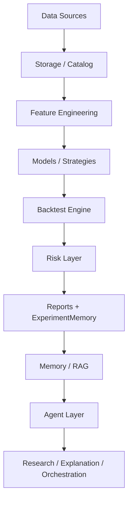

# Quant MAS Documentation

**Quant MAS is a research-first multi-agent quantitative research platform.**  
**Quant MAS 是一个以科研为核心的多智能体量化研究平台。**

This page is the main documentation entry point for students, researchers, and contributors.

---

## Vision / 项目愿景

Quant MAS explores how deterministic quantitative engines and lightweight agent systems can work together safely.

The project follows one core principle:

> Quant Engine computes. Agent Layer explains, orchestrates, and reports.

中文说明：

> Quant Engine 负责确定性计算；Agent Layer 负责研究、规划、解释、报告和工具编排。

LLM agents are not allowed to directly place live orders. Trading signals must go through backtesting, risk checks, audit, and human confirmation.

---

## System Architecture / 系统架构



Current layers:

| Layer | Implemented |
|---|---|
| Quant Engine | Parquet storage, data catalog, OHLCV validation, features, labels, MA Cross, MLSignalStrategy, backtesting, risk, metrics |
| Tool Layer | DataSummaryTool, BacktestTool, TrainModelTool, ReportTool, RiskTool, MLBacktestTool, PipelineTool |
| Agent Layer | BaseAgent, MockLLMClient, SupervisorAgent, ReportAgent, ResearchAgent |
| Memory Layer | ExperimentMemory, JsonMemoryStore, SqliteMemoryStore, TradeMemory stub |
| RAG Layer | Document loader, SimpleRetriever, HashEmbeddingClient, InMemoryVectorStore, HybridRetriever |
| Workflow | Sequential workflow plus optional LangGraph backend |
| Text Signals | Mock sentiment, FinBERT skeleton, LoRA skeleton, text signal feature merge |

中文概览：

- 量化核心：数据、特征、模型、策略、回测、风控。
- 工具层：将量化能力包装成 Agent 可调用工具。
- 智能体层：负责解释、报告、路由和研究辅助。
- 记忆/RAG：用于查询实验记录、报告和研究笔记。
- 文本信号：第一版支持 mock/FinBERT/LoRA 骨架和结构化特征融合。

---

## Agent Design / Agent 设计

Quant MAS currently uses lightweight agents rather than a heavy framework-first design.

Implemented agents:

- **SupervisorAgent**: deterministic keyword routing to registered tools.
- **ReportAgent**: report narrative generation through an LLM boundary, mock-safe by default.
- **ResearchAgent**: builds on structured context from Memory/RAG and produces research hypotheses, evidence summaries, and suggested experiments.

Safety rules:

- Agents do not directly place live orders.
- Agents do not modify Quant Engine metrics.
- LLM output is treated as narrative or hypothesis, not factual measurement.
- Tests use `MockLLMClient` or mocked HTTP only.

中文说明：

- SupervisorAgent 是规则路由，不依赖真实 LLM。
- ResearchAgent 只做研究解释和实验建议。
- ReportAgent 可选使用真实 OpenAI-compatible API，但默认关闭。

---

## Quant Engine

The deterministic engine includes:

- data fetcher abstractions and multiple source skeletons;
- Parquet storage and YAML-driven paths;
- technical indicators and future labels;
- MovingAverageCrossStrategy;
- MLSignalStrategy;
- cost models, slippage, metrics, and reports;
- BacktestEngine with next-bar execution;
- Risk layer with position and drawdown checks;
- walk-forward out-of-sample evaluation.

Research discipline:

- no random split for time-series model training;
- no future labels in features;
- no same-bar signal/same-bar execution;
- no future text leakage when merging text signals.

---

## Memory and RAG

Implemented memory/RAG components:

- JSON experiment memory;
- SQLite experiment memory backend;
- append-only trade memory stub;
- local document loader for Markdown, text, and JSON;
- keyword retrieval;
- deterministic hash embeddings;
- in-memory vector store;
- hybrid retrieval.

These modules provide context for `ResearchAgent` and CLI tools such as:

```bash
python scripts/query_memory.py --help
python scripts/index_documents.py --help
python scripts/run_research_agent.py --task "Explain walk-forward OOS baseline"
```

中文说明：

Memory/RAG 目前用于检索实验记录、研究笔记和报告，为 ResearchAgent 提供上下文，不负责交易执行。

---

## Experiment Results / 实验结果

Verified project status:

- Current test baseline: **161 passed**
- Walk-forward OOS baseline: **EXP-20260602-008**, `oos.sharpe = 0.586`
- GPU LightGBM path has been server-verified after installing CUDA-enabled LightGBM
- M5 ResearchAgent has been smoke-tested with OpenAI-compatible LLM configuration
- M6 text signal layer is implemented with mock-safe tests

Important: single-run backtest metrics are not paper-level evidence. Research conclusions should compare against walk-forward OOS results.

重要说明：单段回测指标不能冒充论文主结果。论文级主指标必须使用 Walk-forward OOS 对比。

Detailed logs:

- [Experiment Log](experiment_log.md)
- [Progress](progress.md)
- [Repo Polish Checklist](repo_polish_checklist.md)
- [Research Protocol](research_protocol.md)

---

## Learning Path / 学习路线

Recommended reading order:

1. Read [README](../README.md) for the project overview.
2. Read [Architecture](architecture.md) to understand the layers.
3. Run `python -m pytest -v`.
4. Run a local mock pipeline.
5. Study feature engineering and backtesting.
6. Study ExperimentMemory and RAG.
7. Try SupervisorAgent and ResearchAgent in mock mode.
8. Read the research protocol before interpreting experiment metrics.

中文学习建议：

1. 先跑通测试。
2. 再看数据、特征、回测和风控。
3. 然后理解 ToolRegistry 和 SupervisorAgent。
4. 最后研究 Memory/RAG、ResearchAgent 和文本信号模块。

---

## Who Is This For? / 适用人群

Quant MAS may be useful for:

- students building a serious research portfolio;
- quantitative research beginners learning the full pipeline;
- ML learners practicing time-series validation;
- agent-system learners studying safe tool orchestration;
- internship applicants showing engineering and research discipline.

适合：

- 科研项目 / SRTP / 课程项目；
- 量化研究入门；
- 机器学习时间序列实验；
- Agent 工具编排学习；
- 实习申请作品集。

---

## Key Commands

```bash
python -m pytest -v

python scripts/run_pipeline.py --skip-download --experiment-name local_pipeline_demo

python scripts/train_model.py --config configs/train.yaml

python scripts/run_walk_forward.py --config configs/walk_forward.yaml

python scripts/run_research_agent.py --task "Summarize latest experiment"

python scripts/train_text_model.py --mode mock --config configs/text_model.yaml --dry-run
```

---

## Contribution

Please read [CONTRIBUTING.md](../CONTRIBUTING.md).  
欢迎 Star / Fork / Issue / PR。

Contact: 3240101782@zju.edu.cn

---

## Disclaimer

Quant MAS is for research and education only. It is not financial advice, investment advice, or a recommendation to trade.

Quant MAS 仅用于科研和教育目的，不构成投资建议或交易建议。
