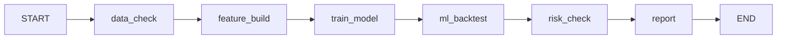

# LangGraph ResearchWorkflow（Plus M4）

更新时间：2026-06-03

> 配置：`configs/langgraph_workflow.yaml` · CLI：`scripts/run_langgraph_workflow.py`

## 定位

**ResearchWorkflow** 是与 **SupervisorAgent 并存** 的实验性 DAG，**不替换** `run_agent.py` 默认路径。

| 维度 | SupervisorAgent | ResearchWorkflow |
|------|-----------------|------------------|
| 触发 | 用户一句 task → **一个** Tool | 固定 **6 步** DAG |
| 路由 | 关键词规则 | 预定义节点顺序 |
| LLM | 无 | M4 无（M5 再接入） |
| 状态 | 单步 events | `QuantWorkflowState` |

## 节点图



| 节点 | 调用 |
|------|------|
| data_check | 检查 raw/features 路径 |
| feature_build | `build_feature_table_from_config` |
| train_model | `TrainModelTool` |
| ml_backtest | `MLBacktestTool` |
| risk_check | `RiskTool` |
| report | `ReportTool` |

## 后端

| backend | 说明 |
|---------|------|
| **sequential**（默认） | 纯 Python 顺序执行，**pytest 不依赖 langgraph** |
| **langgraph** | 需 `pip install -e ".[orchestration]"`（`langgraph>=0.2`） |

## 本地 / pytest（dry-run）

```bash
python scripts/run_langgraph_workflow.py --help
python scripts/run_langgraph_workflow.py --dry-run --backend sequential
python -m pytest tests/test_langgraph_workflow.py -v
# 核心安装：11 passed, 1 skipped（138 项全量时 137+1 skip）
# 含 orchestration：12 passed（138 项全量时 138 passed）
```

## 服务器 smoke（已验证 EXP-20260602-016）

```bash
cd /mnt/localDisk3/weizian/Quant-MAS
git pull origin main   # 需 >= c0fa5e3（修复 M-016 建边 zip strict）
conda activate /mnt/localDisk3/weizian/conda_envs/quant-mas
python -m pip install -e .
python -m pip install -e ".[orchestration]"

python -m pytest tests/test_langgraph_workflow.py::test_langgraph_build_and_dry_run_when_available -v
python scripts/run_langgraph_workflow.py --dry-run --backend sequential
python scripts/run_langgraph_workflow.py --dry-run --backend langgraph
```

全量 pytest（可选）：核心 **137 passed, 1 skipped**；含 orchestration **138 passed**。

## 真实 workflow（非 dry-run）

仅在有意记录 **EXP-LG-001** 时使用；需本地 features/model 路径，可能耗 GPU。**未跑过不虚构 metrics。**

```bash
python scripts/run_langgraph_workflow.py \
  --no-dry-run \
  --backend sequential \
  --storage-config configs/storage.server.yaml \
  --features-path /mnt/localDisk3/weizian/datasets/features/features.parquet
```

## 已知问题

- **M-016**（已修复 `c0fa5e3`）：`zip(NODE_ORDER, NODE_ORDER[1:], strict=True)` 长度不等导致 langgraph backend 失败。详见 [`mistakes.md`](../mistakes.md#m-016-langgraph-建边-zipstrict-长度不匹配)。

## 与 OOS baseline

Workflow 产出写入 ExperimentMemory 后，须用 M1 `compare_experiments.py` 与 **EXP-20260602-008**（oos.sharpe **0.586**）对比。

## 相关文档

- [codex_prompt_M4.md](codex_prompt_M4.md)
- [architecture.md](architecture.md)
- [项目plus设计.md §M4](../项目plus设计.md#m4langgraph-工作流编排)
