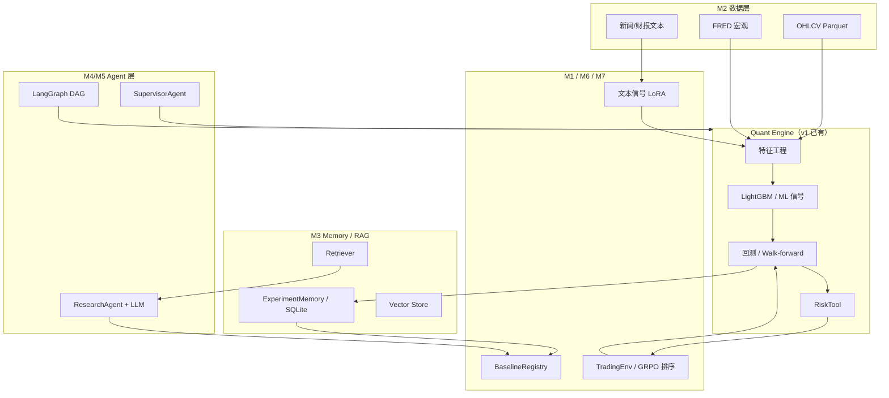

# Quant MAS Plus 设计（v2 研究与扩展规划）

更新时间：2026-06-01

> 本文档在 **Prompt 1–20 主链路已完成**（第零～四阶段）的基础上，规划 **Quant MAS v2** 的研究型升级路线。  
> 基线状态：本地 **115 passed**（EXP-20260602-011）；服务器 **EXP-20260602-012**（test_data_sources 13/13，EXP-DATA-001 ✅）。  
> 与 `项目进度.md` / `项目指导.md` 的关系：后者记录「已完成什么」；本文档记录「接下来怎么优化、怎么给 Codex/Cursor 下指令」。

---

## 目录

1. [定位与原则](#1-定位与原则)
2. [当前基线（不可遗忘）](#2-当前基线不可遗忘)
3. [v2 八条主线与优先级](#3-v2-八条主线与优先级)
4. [M1：研究基线与实验规范](#m1研究基线与实验规范)
5. [M2：数据源扩展](#m2数据源扩展)
6. [M3：数据库与 Memory / RAG 升级](#m3数据库与-memory--rag-升级)
7. [M4：LangGraph 工作流编排](#m4langgraph-工作流编排)
8. [M5：上下文工程与真实 LLM 接入](#m5上下文工程与真实-llm-接入)
9. [M6：金融文本大模型 / 开源模型微调](#m6金融文本大模型--开源模型微调)
10. [M7：强化学习 / GRPO 实验](#m7强化学习--grpo-实验)
11. [M8：MCP / A2A 协议化扩展](#m8mcp--a2a-协议化扩展)
12. [总执行路线表](#12-总执行路线表)
13. [环境变量与 API 一览](#13-环境变量与-api-一览)
14. [第五阶段及后续流程图](#14-第五阶段及后续流程图)
15. [文献与科研方向备忘](#15-文献与科研方向备忘)

---

## 1. 定位与原则

### 1.1 从原型到研究平台

| 维度 | v1（已完成） | v2（本文档） |
|------|-------------|-------------|
| 目标 | 可运行、可测试、可回测、可记录 | 可比较、可扩展、可写论文 |
| Agent | 规则路由 Supervisor + MockLLM | + ResearchAgent、可选真实 LLM（仅解释/报告） |
| Memory/RAG | JSON + 关键词 SimpleRetriever | + SQLite / 向量库 / 可选图库 |
| ML | LightGBM 结构化 baseline | 保留 baseline + 文本信号 + 可选 LoRA |
| 编排 | 单步 Supervisor 路由 | + LangGraph 实验性 DAG |
| 交易 | 回测 + 风控，**不做实盘** | 仍 **不做实盘**；RL 仅模拟环境 |

### 1.2 硬性原则（全程遵守）

1. **LLM 不直接下单**；所有仓位建议须经回测、RiskTool、审计。
2. **论文/报告主指标** 必须用 Walk-forward **OOS**（当前 baseline：sharpe **0.586**），不得用单段 ML 回测 sharpe 2.78 冒充样本外。
3. **pytest 不联网、不调真实 LLM**；外部 API 仅在服务器手工验证或单独 integration 脚本中测。
4. **API Key 只放 `.env`**，不入 git、不写进日志。
5. **一次只交给 Codex 一个模块**（M1→M8 顺序），每步全量 `python -m pytest -v` 通过后再进下一步。

### 1.3 三端分工（延续 v1）

| 角色 | 职责 |
|------|------|
| **Codex** | 写 Python 模块、mock 测试、CLI 骨架 |
| **Cursor** | 文档、服务器 SSH、真实 API/ GPU 实验、EXP 记录 |
| **ChatGPT** | 拆任务、审查方案、论文结构 |
| **GitHub** | 同步代码（不含大数据/模型权重） |
| **服务器** | 真实数据下载、训练、walk-forward、FinBERT/LoRA 小样本 |

---

## 2. 当前基线（不可遗忘）

### 2.1 工程完成度

- **第零～四阶段 + Prompt 13 文档收口** ✅
- **测试**：本地 **115 passed**（EXP-20260602-011）；服务器 EXP-20260602-012 + EXP-DATA-001 ✅
- **Research Layer（M1）**：BaselineRegistry、`compare_experiments.py` ✅
- **Data Layer（M2）**：fetchers 子包、DataSourceRegistry、FRED/SEC 等 ✅ 本地
- **Agent 工具（7 个）**：data_summary / backtest / train_model / report / risk_check / ml_backtest / pipeline
- **Memory/RAG 雏形**：ExperimentMemory 增强、TradeMemory 空壳、SimpleRetriever

### 2.2 研究基线实验（服务器真实数据）

| 实验 | 内容 | 关键结果 | 用途 |
|------|------|----------|------|
| EXP-20260601-004 | Stooq + ma_cross | sharpe ≈ 1.00 | 传统策略 baseline |
| EXP-20260601-006 | CPU LightGBM | test AUC 0.466 | ML baseline |
| EXP-20260602-005 | ML 单段回测 | sharpe **2.78** | ⚠️ in-sample，**禁止作 OOS 结论** |
| EXP-20260602-008 | Walk-forward 服务器 | **OOS sharpe 0.586** | **论文主指标** |

### 2.3 v2 所有新实验必须与上表对比

新增模块（RAG 增强、LangGraph、文本模型、RL）的输出必须进入 **BaselineRegistry / compare_experiments**（M1），并标明是否 OOS。

---

## 3. v2 八条主线与优先级

```
优先级 1（先做）  M1 研究基线  →  M2 数据扩展  →  M3 Memory/RAG v2
优先级 2          M4 LangGraph  →  M5 上下文/LLM
优先级 3          M6 文本大模型微调
优先级 4          M7 RL / GRPO
最后              M8 MCP / A2A
```

**为什么这个顺序？**

- 没有 **M1 统一比较**，后面模型/Agent 实验无法写论文。
- 没有 **M2 数据**，文本/RAG/RL 缺输入。
- **M3** 在 SimpleRetriever 上升级，成本低、收益高。
- **LangGraph / LLM** 应在工具与数据稳定后再接，避免「空编排」。
- **大模型做价格预测** 风险高；优先 **文本信号 + 结构化 ML 融合**。
- **RL** 依赖稳定环境与 OOS reward；**MCP** 安全风险大，最后做 adapter。

---

## M1：研究基线与实验规范

### 目标

建立统一实验基线管理，强制后续实验与 EXP-20260602-008 对比。

### 需要连接的 API

**无**（纯本地/JSON）。

### 给 Codex 的提示词

```
你正在开发 Quant MAS v2。当前项目 Prompt 1–20 主链路已完成，测试基线为 98 passed。现在请实现「研究基线与实验规范」模块。

目标：
建立统一实验基线管理系统，用于比较 MA Cross、LightGBM、MLSignalStrategy、Walk-forward、后续 RAG/LLM/RL 实验。

需要实现：

1. src/quant_mas/research/baseline.py
   - BaselineRun dataclass
   - BaselineRegistry
   - add_baseline() / list_baselines() / compare_runs() / get_best(metric_path="oos.sharpe")

2. src/quant_mas/research/metrics_table.py
   - collect_experiment_metrics() / build_comparison_table()
   - 支持嵌套 metric：oos.sharpe、test_auc、max_drawdown

3. scripts/compare_experiments.py
   - 从 ExperimentMemory 读取历史实验
   - 输出 comparison.csv 和 comparison.md
   - 默认比较：ma_cross / lightgbm / ml_backtest / walk_forward

4. docs/research_protocol.md
   - 实验必须记录：数据区间、标的、特征、模型、切分、是否 OOS、成本、风控、主指标
   - 明确：论文主指标必须用 Walk-forward OOS

5. tests/test_research_baseline.py
   - tmp_path + synthetic records；嵌套 metric；get_best("oos.sharpe")

要求：不联网、不调 LLM、不破坏 ExperimentMemory、全量 pytest 通过。

验收：
1. python scripts/compare_experiments.py --help
2. pytest tests/test_research_baseline.py
3. 全量 pytest 通过
```

### 给 Cursor 的提示词

```
请更新 Quant MAS 研究文档（Prompt 13 收口后的增量）：

1. docs/progress.md 新增「Quant MAS v2：M1 研究基线」小节。
2. docs/experiment_log.md 补充「实验比较表」模板。
3. docs/architecture.md 新增 Research Layer（BaselineRegistry、MetricsTable、compare_experiments.py）。
4. 强调后续实验必须与 EXP-20260602-008 OOS baseline 对比。
5. 不虚构实验结果；未跑过的标「待验证」。
```

### 运行位置与验收

| 项目 | 说明 |
|------|------|
| 开发 | 本地 Codex |
| 测试 | `python -m pytest tests/test_research_baseline.py -v` |
| 服务器 | 可选：对真实 experiments.json 跑 `compare_experiments.py` |
| EXP 建议 | EXP-M1-001 本地 pytest；EXP-M1-002 服务器比较表 |

---

## M2：数据源扩展

### 目标

多数据源可切换；yfinance 备用，Stooq 已验证，扩展 Alpha Vantage / Finnhub / FRED / SEC EDGAR。

### 需要连接的 API

| 环境变量 | 用途 | 备注 |
|----------|------|------|
| `STOOQ_API_KEY` | OHLCV | ✅ 已用 |
| `ALPHAVANTAGE_API_KEY` | 美股 OHLCV / 指标 | 免费版限速 |
| `FINNHUB_API_KEY` | OHLCV / 新闻 | |
| `FRED_API_KEY` | 宏观序列 | 利率、CPI 等 |
| `SEC_EDGAR_USER_AGENT` | SEC 合规标识 | 必填格式：`Name email@domain.com` |

可选后期：`TIINGO_API_KEY`、`POLYGON_API_KEY`、`NEWSAPI_KEY`。

### 给 Codex 的提示词

```
请为 Quant MAS v2 实现多数据源扩展模块。

当前已有 YFinanceFetcher、StooqFetcher。新增 AlphaVantageFetcher、FinnhubFetcher、FREDFetcher、SECEDGARFetcher 骨架，统一接入 download_data.py。

需要实现：

1. src/quant_mas/data/fetchers/alpha_vantage_fetcher.py — OHLCV，ALPHAVANTAGE_API_KEY
2. src/quant_mas/data/fetchers/finnhub_fetcher.py — OHLCV，FINNHUB_API_KEY
3. src/quant_mas/data/fetchers/fred_fetcher.py — fetch_series，FRED_API_KEY
4. src/quant_mas/data/fetchers/sec_edgar_fetcher.py — submissions/facts JSON，SEC_EDGAR_USER_AGENT
5. src/quant_mas/data/fetchers/registry.py — DataSourceRegistry
6. scripts/download_data.py — 新增 --source、--series-id 等
7. configs/data_sources.yaml
8. tests/test_data_sources.py — mock HTTP，不真联网

要求：API key 不进代码；失败时提示设置 .env；不破坏现有 stooq/yfinance 测试。

验收：
1. python scripts/download_data.py --source alpha_vantage --help
2. pytest tests/test_data_sources.py
3. 全量 pytest 通过
```

### 给 Cursor 的提示词

```
1. 新增 docs/data_sources.md：各源用途、env、限速、已验证/待验证状态。
2. docs/progress.md 增加 M2 任务状态。
3. docs/experiment_log.md 增加 API 数据验证 EXP 模板（如 EXP-DATA-001）。
4. 服务器上（有 key 时）试跑小样本 download，记录 EXP；无 key 则标待验证。
5. 不写真实 API key。
```

### 运行位置与验收

| 项目 | 说明 |
|------|------|
| Codex | 本地 + mock 测试 |
| Cursor | 服务器真实 API smoke test |
| 数据落盘 | `datasets/raw/` Parquet；SEC JSON → `datasets/raw/sec/` |

---

## M3：数据库与 Memory / RAG 升级

### 目标

三库结构（渐进式）：

| 层级 | 用途 | v2 第一版 | 扩展 |
|------|------|-----------|------|
| 元数据 | 实验、指标、artifact | JSON → **SQLite** | PostgreSQL |
| 向量 | 文档/报告 embedding | **InMemory / FAISS** | pgvector / Milvus |
| 图 | 策略-特征-实验关系 | 接口预留 | Neo4j |

保留现有 SimpleRetriever，新增可插拔后端。

### 需要连接的 API / 服务

```env
# 默认（pytest 必需）
# 无外部依赖

# 可选扩展
POSTGRES_DSN=postgresql://...
VECTOR_STORE=faiss          # 或 pgvector
NEO4J_URI=bolt://...
NEO4J_USER=...
NEO4J_PASSWORD=...
EMBEDDING_PROVIDER=local    # 或 openai_compatible
EMBEDDING_BASE_URL=...
EMBEDDING_API_KEY=...
EMBEDDING_MODEL=...
```

### 给 Codex 的提示词

> **完整版**（含验收清单、兼容性要求）：[docs/codex_prompt_M3.md](docs/codex_prompt_M3.md)

```
请为 Quant MAS v2 实现可插拔 Memory / RAG 存储后端。
（详见 docs/codex_prompt_M3.md — 复制「固定前缀」+「M3 主任务」整段）
```

### 给 Cursor 的提示词

```
1. 检查服务器是否有 Docker。
2. 新增 docs/database_setup.md：可选 Postgres+pgvector、Neo4j 启动说明（占位符密码）。
3. 无 Docker 则记录「默认 SQLite + InMemoryVectorStore」。
4. docs/architecture.md 补充 Memory/RAG v2 分层。
5. 不运行删数据命令；不提交密码。
```

---

## M4：LangGraph 工作流编排

### 目标

**实验性** DAG，**不替换** SupervisorAgent：

`DataCheck → FeatureBuild → TrainModel → MLBacktest → RiskCheck → Report`

### 需要连接的 API

第一版 **无**（dry-run 用 mock / synthetic）。

### 给 Codex 的提示词

```
请为 Quant MAS v2 增加实验性 LangGraph 编排层，不替换 SupervisorAgent。

ResearchWorkflow 节点：DataCheck → FeatureBuild → TrainModel → MLBacktest → RiskCheck → Report

需要实现：

1. src/quant_mas/orchestration/langgraph_state.py — QuantWorkflowState
2. src/quant_mas/orchestration/nodes.py — 每节点只调现有 Tool
3. src/quant_mas/orchestration/langgraph_workflow.py — build/run
4. scripts/run_langgraph_workflow.py — --dry-run
5. configs/langgraph_workflow.yaml
6. tests/test_langgraph_workflow.py — 无 langgraph 时 skip；验证节点顺序与 state.errors

要求：不接 broker、不调 LLM、工具调用记事件、全量 pytest 通过。

验收：
1. python scripts/run_langgraph_workflow.py --help
2. pytest tests/test_langgraph_workflow.py
```

### 给 Cursor 的提示词

```
1. 新增 docs/langgraph_workflow.md：节点图、dry-run 与服务器真实运行步骤。
2. docs/progress.md 记录「LangGraph PoC：已实现/待验证」。
3. 若跑真实 workflow，写 EXP-LG-001；未跑则不虚构。
4. 对比 DAG 输出与 Supervisor 单步调用结果是否一致（验收项）。
```

### 第五阶段定位

对应 `项目指导.md` **第五阶段（LangGraph）** — 本文档 M4 为其实施细则；完成 M1–M3 后再正式启用。

---

## M5：上下文工程与真实 LLM 接入

### 目标

ResearchAgent / ReportAgent 可接真实 LLM，**仅**用于研究解释、报告摘要、实验建议 — **不**用于生成订单。

### 需要连接的 API

```env
LLM_PROVIDER=deepseek          # 或 openai_compatible / local_vllm
LLM_BASE_URL=https://api.deepseek.com
LLM_API_KEY=...
LLM_MODEL=deepseek-chat
```

本地 vLLM 示例：`LLM_BASE_URL=http://127.0.0.1:8000/v1`。

### 给 Codex 的提示词

```
请实现上下文工程与真实 LLM 接入（仅研究/报告，禁止直接交易）。

需要实现：

1. src/quant_mas/context/context_schema.py — Market/Experiment/Risk/RAG/AgentContextBundle
2. src/quant_mas/context/context_builder.py — 从 Memory/RAG/metrics 构建上下文
3. src/quant_mas/context/compression.py — 保留 oos.sharpe 等关键字段，不塞 DataFrame
4. src/quant_mas/core/llm.py 增强 — OpenAICompatibleLLMClient（env 读取）；测试仍用 Mock
5. src/quant_mas/agents/research_agent.py — 输出 hypothesis/evidence/suggested_experiments
6. ReportAgent 增强 — --use-llm 默认 false；LLM 不得改 metrics
7. scripts/run_research_agent.py
8. tests/test_context_engineering.py

安全：默认 use_llm=False；事实指标与 LLM 解释分离；key 不打日志。

验收：pytest tests/test_context_engineering.py；无 key 时流程仍可跑。
```

### 给 Cursor 的提示词

```
1. 新增 docs/context_engineering.md。
2. docs/architecture.md 增加 Context Layer。
3. 小规模 --use-llm 试跑（可选），EXP-LLM-001；记录 token 与输出样例，不提交 key。
```

---

## M6：金融文本大模型 / 开源模型微调

### 目标

**不**用 LLM 直接替代 LightGBM 做价格预测。路线：

1. FinBERT → sentiment baseline  
2. Qwen/DeepSeek + LoRA → 金融文本分类  
3. `text_signals` 并入 features  
4. 结构化 ML + 文本因子融合 → walk-forward OOS 评估  

### 需要连接的 API / 服务

```env
HF_TOKEN=...
WANDB_API_KEY=...          # 可选
MODEL_CACHE_DIR=/mnt/localDisk3/weizian/models/hf
```

依赖：`transformers`、`peft`、`accelerate`（服务器 GPU）。

### 给 Codex 的提示词

```
请增加金融文本模型训练模块。大模型只做文本信号，不替换 LightGBM，不直接下单。

需要实现：

1. src/quant_mas/text/data_schema.py — FinancialTextRecord / TextSignalRecord
2. src/quant_mas/text/dataset.py — 按时间切分 train/val/test
3. src/quant_mas/text/finbert_baseline.py — predict_sentiment
4. src/quant_mas/text/lora_finetune.py — train_lora_text_classifier 骨架（peft）
5. scripts/train_text_model.py — --mode finbert_baseline/lora
6. src/quant_mas/features/text_signals.py — merge 到 features，禁止未来新闻
7. configs/text_model.yaml
8. tests/test_text_signals.py — mock，不加载真实大模型

验收：pytest tests/test_text_signals.py；train_text_model.py --help
```

### 给 Cursor 的提示词

```
1. 服务器：nvidia-smi；检查 transformers/peft。
2. 新增 docs/text_model_plan.md。
3. experiment_log 模板：EXP-TEXT-001 FinBERT；EXP-TEXT-002 Qwen LoRA 小样本。
4. 小样本训练后跑 walk-forward，与 EXP-20260602-008 对比。
5. HF token 不入库。
```

---

## M7：强化学习 / GRPO 实验

### 目标

模拟环境 + 策略候选 **group-relative** 排序；GRPO 先用于「多候选 OOS reward 比较」，**不**让 LLM 直接输出订单。

### 需要连接的 API

无金融 API；可选 `WANDB_API_KEY` 记录曲线。

### 给 Codex 的提示词

```
请实现 RL 实验环境第一版（simulation only，不接 broker）。

需要实现：

1. src/quant_mas/rl/trading_env.py — gymnasium 风格；long-only 离散仓位
2. src/quant_mas/rl/reward.py — return / cost / drawdown / turnover 惩罚
3. src/quant_mas/rl/baseline_policy.py — Random / BuyAndHold / MLCopy
4. scripts/run_rl_baseline.py
5. src/quant_mas/rl/grpo_experiment.py — 多候选策略 OOS group-relative reward 排名
6. tests/test_trading_env.py / tests/test_grpo_experiment.py

要求：无 future leakage；策略输出仍过 RiskTool；报告标 simulation only。

验收：上述 pytest；run_rl_baseline.py --help
```

### 给 Cursor 的提示词

```
1. 新增 docs/rl_plan.md。
2. EXP-RL-001 TradingEnv baseline；EXP-RL-002 GRPO-style ranking。
3. reward 以 walk-forward OOS 窗口为基准（与 M1 对齐）。
```

---

## M8：MCP / A2A 协议化扩展

### 目标

内部 **adapter + 权限策略**；**不**连接真实外部 MCP server；**不**暴露 shell / broker / 任意写文件。

### 需要连接的 API

第一版无；后期可选 MCP server（需 security review）。

### 给 Codex 的提示词

```
请实现 MCP-style 工具适配与 A2A Agent Card 雏形（内部安全封装 only）。

需要实现：

1. src/quant_mas/protocols/mcp/types.py — MCPToolSpec / MCPToolCall / MCPToolResult
2. src/quant_mas/protocols/mcp/policy.py — allow/deny/require_confirmation；deny shell/broker/order
3. src/quant_mas/protocols/mcp/adapter.py — tool_to_mcp_spec；经 policy 调用
4. src/quant_mas/protocols/a2a/agent_card.py — AgentCard JSON
5. scripts/export_agent_cards.py
6. tests/test_protocols.py

验收：pytest tests/test_protocols.py；export_agent_cards.py --help
```

### 给 Cursor 的提示词

```
1. 新增 docs/protocols.md — MCP 仅工具标准化；A2A 仅能力描述。
2. 明确禁止：shell、broker、order、API key 泄露、任意文件写。
3. docs/progress.md 记录 M8 状态。
```

---

## 12. 总执行路线表

| 模块 | 顺序 | Codex 交付 | Cursor 交付 | 主要 API | 服务器 |
|------|------|------------|-------------|----------|--------|
| **M1** 研究基线 | 1 | baseline.py、compare_experiments | research_protocol、架构图 | 无 | 可选跑比较表 |
| **M2** 数据扩展 | 2 | 多 fetcher + registry | data_sources.md、API 验证 | Stooq/AV/Finnhub/FRED/SEC | ✅ |
| **M3** Memory/RAG v2 | 3 | SQLite/InMemory/索引脚本 | database_setup.md | Embedding 可选 | ✅ |
| **M4** LangGraph | 4 | workflow + nodes | langgraph_workflow.md | 无 | dry-run / 可选 |
| **M5** 上下文/LLM | 5 | ContextBuilder、ResearchAgent | context_engineering.md | DeepSeek/OpenAI-compatible | 可选 |
| **M6** 文本大模型 | 6 | FinBERT/LoRA 骨架 | text_model_plan、GPU 实验 | HF_TOKEN | ✅ |
| **M7** RL/GRPO | 7 | TradingEnv、GRPO ranking | rl_plan.md | W&B 可选 | ✅ |
| **M8** MCP/A2A | 8 | protocol adapter | protocols.md | 暂不接 | ❌ |

**推荐节奏**：每完成一个 M，本地 pytest → push → 服务器 pull pytest →（若需）Cursor 记 EXP → 再开下一个 M。

---

## 13. 环境变量与 API 一览

### 13.1 `.env.example` 建议结构（v2 增量）

```env
# === v1 已有 ===
STOOQ_API_KEY=

# === M2 行情与宏观 ===
ALPHAVANTAGE_API_KEY=
FINNHUB_API_KEY=
FRED_API_KEY=
SEC_EDGAR_USER_AGENT=YourName your@email.com

# === M3 Embedding（可选）===
EMBEDDING_PROVIDER=local
EMBEDDING_BASE_URL=
EMBEDDING_API_KEY=
EMBEDDING_MODEL=

# === M5 LLM（可选）===
LLM_PROVIDER=deepseek
LLM_BASE_URL=https://api.deepseek.com
LLM_API_KEY=
LLM_MODEL=deepseek-chat

# === M6  Hugging Face（可选）===
HF_TOKEN=
MODEL_CACHE_DIR=/mnt/localDisk3/weizian/models/hf
WANDB_API_KEY=

# === M3 扩展数据库（可选，不进 pytest）===
POSTGRES_DSN=
NEO4J_URI=
NEO4J_USER=
NEO4J_PASSWORD=
```

### 13.2 API 申请入口（备忘）

| 服务 | 申请 |
|------|------|
| Stooq | 已有 |
| Alpha Vantage | https://www.alphavantage.co/support/#api-key |
| Finnhub | https://finnhub.io/register |
| FRED | https://fred.stlouisfed.org/docs/api/api_key.html |
| SEC EDGAR | 无需 key，需 User-Agent |
| DeepSeek / OpenAI-compatible | 各厂商控制台 |
| Hugging Face | https://huggingface.co/settings/tokens |

---

## 14. 第五阶段及后续流程图

### 14.1 与工程「第五～六阶段」的对应

| 工程阶段（项目指导） | Plus 模块 |
|---------------------|-----------|
| 第五阶段 LangGraph | M4（+ M5 Agent 增强） |
| 第六阶段 Paper Trading | M7 模拟环境 + TradeMemory 实装（仍非实盘） |
| 科研横切 | M1、M2、M3、M6、M8 |

### 14.2 v2 研究 Pipeline（目标态）



### 14.3 单轮研究实验标准流程（M1 驱动）

1. 定义 hypothesis + 数据区间 + 是否 OOS  
2. 跑 pipeline（Supervisor 或 LangGraph dry-run → 真实服务器）  
3. RiskTool 审计 target_weight  
4. Walk-forward 产出 OOS metrics  
5. `compare_experiments.py` 与 EXP-20260602-008 对比  
6. Cursor 写入 `docs/experiment_log.md`  
7. ResearchAgent（M5）生成报告摘要，**标明事实 vs LLM 解释**

---

## 15. 文献与科研方向备忘

| 方向 | 要点 | 与 Plus 模块 |
|------|------|-------------|
| LLM 量化交易综述 | LLM 宜 RAG + 工具 + 风控，不宜黑箱下单 | M5、M8 |
| 多智能体金融模拟 | 策略/风控/报告 Agent 分工 | M4、M7 |
| LangGraph 工程实践 | 有状态 DAG、supervisor 节点 | M4 |
| FinLoRA / 金融 LoRA | 文本任务性价比 | M6 |
| MCP 安全 | 工具权限、prompt injection | M8 最后做 |
| Walk-forward OOS | 样本外 sharpe 方可比 | M1 强制 |

---

## 附录：每次交给 Codex 前的固定前缀

与 `项目指导.md` §10.1 相同，**每次**先贴：

```
你正在开发 Quant MAS 科研项目。
路径：D:\scientific reasearch and work\SRTP\Quant MAS
测试基线：本地 115 passed（Plus M2）；OOS baseline sharpe 0.586（EXP-20260602-008）。
LLM 不允许直接下单；pytest 不联网不调真实 LLM。
请只实现当前一个模块，完成后 python -m pytest -v 全量通过。
详细需求见 docs/codex_prompt_M3.md 或本文档 M3 章节。
```

---

*文档版本：2026-06-01 · Quant MAS Plus v2 设计初稿*
