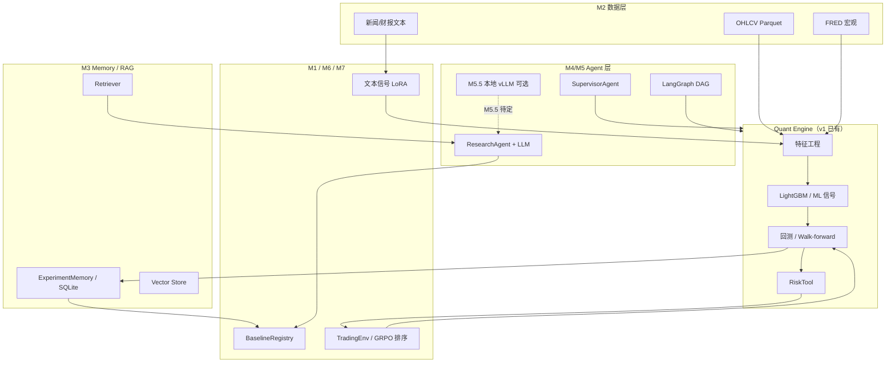

# Quant MAS Plus 设计（v2 研究与扩展规划）

更新时间：2026-06-03

> 本文档在 **Prompt 1–20 主链路已完成**（第零～四阶段）的基础上，规划 **Quant MAS v2** 的研究型升级路线。  
> 基线状态：本地 **137+1 skip**（138 项；EXP-20260602-015）；服务器 M4 langgraph ✅（EXP-20260602-016 @ `c0fa5e3`）。  
> **当前执行**：M1–M6 本地 ✅（EXP-20260602-019）→ **M6 服务器 + EXP-TEXT-001**。  
> 与 `项目进度.md` / `项目指导.md` 的关系：后者记录「已完成什么」；本文档记录「接下来怎么优化、怎么给 Codex/Cursor 下指令」。

---

## 目录

1. [定位与原则](#1-定位与原则)
2. [当前基线（不可遗忘）](#2-当前基线不可遗忘)
3. [v2 八条主线与优先级](#3-v2-八条主线与优先级)
4. [M1：研究基线与实验规范](#m1研究基线与实验规范)
5. [M2：数据源扩展](#m2数据源扩展)
6. [M3：数据库与 Memory / RAG 升级](#m3数据库与-memory--rag-升级)
6b. [M3.5：企业 RAG 扩展（待定）](#m35企业-rag-扩展待定)
7. [M4：LangGraph 工作流编排](#m4langgraph-工作流编排)
8. [M5：上下文工程与真实 LLM 接入](#m5上下文工程与真实-llm-接入)
8b. [M5.5：服务器本地 vLLM 进阶（待定）](#m55服务器本地-vllm-进阶待定)
9. [M6：金融文本大模型 / 开源模型微调](#m6金融文本大模型--开源模型微调)
10. [M7：强化学习 / GRPO 实验](#m7强化学习--grpo-实验)
11. [M8：MCP / A2A 协议化扩展](#m8mcp--a2a-协议化扩展)
12. [总执行路线表](#12-总执行路线表)
13. [环境变量与 API 一览](#13-环境变量与-api-一览)
14. [第五阶段及后续流程图](#14-第五阶段及后续流程图)
15. [文献与科研方向备忘](#15-文献与科研方向备忘)

---

## 1. 定位与原则

### 1.1 从原型到研究平台

| 维度 | v1（已完成） | v2（本文档） |
|------|-------------|-------------|
| 目标 | 可运行、可测试、可回测、可记录 | 可比较、可扩展、可写论文 |
| Agent | 规则路由 Supervisor + MockLLM | + ResearchAgent、可选真实 LLM（**M5 第一版：DeepSeek 云端**；**M5.5**：本地 vLLM 进阶） |
| Memory/RAG | JSON + 关键词 SimpleRetriever | **M3 第一版** ✅：SQLite/InMemory/Hash；**M3.5** 扩展：Postgres/pgvector/真 Embedding |
| ML | LightGBM 结构化 baseline | 保留 baseline + 文本信号 + 可选 LoRA |
| 编排 | 单步 Supervisor 路由 | + LangGraph 实验性 DAG |
| 交易 | 回测 + 风控，**不做实盘** | 仍 **不做实盘**；RL 仅模拟环境 |

### 1.2 硬性原则（全程遵守）

1. **LLM 不直接下单**；所有仓位建议须经回测、RiskTool、审计。
2. **论文/报告主指标** 必须用 Walk-forward **OOS**（当前 baseline：sharpe **0.586**），不得用单段 ML 回测 sharpe 2.78 冒充样本外。
3. **pytest 不联网、不调真实 LLM**；外部 API 仅在服务器手工验证或单独 integration 脚本中测。
4. **API Key 只放 `.env`**，不入 git、不写进日志。
5. **一次只交给 Codex 一个模块**（M1→M8 顺序），每步全量 `python -m pytest -v` 通过后再进下一步。

### 1.3 三端分工（延续 v1）

| 角色 | 职责 |
|------|------|
| **Codex** | 写 Python 模块、mock 测试、CLI 骨架 |
| **Cursor** | 文档、服务器 SSH、真实 API/ GPU 实验、EXP 记录 |
| **ChatGPT** | 拆任务、审查方案、论文结构 |
| **GitHub** | 同步代码（不含大数据/模型权重） |
| **服务器** | 真实数据下载、训练、walk-forward、FinBERT/LoRA 小样本 |

---

## 2. 当前基线（不可遗忘）

### 2.1 工程完成度

- **第零～四阶段 + Prompt 13 文档收口** ✅
- **测试**：本地 **161 passed**（EXP-20260602-019）；M5 服务器 **150 passed**（EXP-20260602-018）
- **Context/LLM（M5 第一版）** ✅：ContextBuilder、ResearchAgent、resolve_llm_client；**DeepSeek 云端** smoke ✅（EXP-LLM-001）
- **Text Signal（M6 第一版）** ✅ 本地：text schema、mock classifier、text_signals merge、train_text_model CLI（EXP-20260602-019）
- **M5.5 本地 vLLM**：📋 待定（a6000 上 vLLM OpenAI 兼容端点；见 [§M5.5](#m55服务器本地-vllm-进阶待定)）
- **Memory/RAG v2（M3 第一版）** ✅ 本地：MemoryStore JSON/SQLite、HybridRetriever、index/query CLI（EXP-20260602-013）
- **M3.5 企业 RAG**：📋 待定（真 Embedding + 持久化向量 + Postgres；见 [§M3.5](#m35企业-rag-扩展待定)）
- **Research Layer（M1）**：BaselineRegistry、`compare_experiments.py` ✅
- **Data Layer（M2）**：fetchers 子包、DataSourceRegistry；服务器 EXP-DATA-001 ✅
- **Agent 工具（7 个）**：data_summary / backtest / train_model / report / risk_check / ml_backtest / pipeline

### 2.2 研究基线实验（服务器真实数据）

| 实验 | 内容 | 关键结果 | 用途 |
|------|------|----------|------|
| EXP-20260601-004 | Stooq + ma_cross | sharpe ≈ 1.00 | 传统策略 baseline |
| EXP-20260601-006 | CPU LightGBM | test AUC 0.466 | ML baseline |
| EXP-20260602-005 | ML 单段回测 | sharpe **2.78** | ⚠️ in-sample，**禁止作 OOS 结论** |
| EXP-20260602-008 | Walk-forward 服务器 | **OOS sharpe 0.586** | **论文主指标** |

### 2.3 v2 所有新实验必须与上表对比

新增模块（RAG 增强、LangGraph、文本模型、RL）的输出必须进入 **BaselineRegistry / compare_experiments**（M1），并标明是否 OOS。

---

## 3. v2 八条主线与优先级

### 3.1 当前推荐执行顺序（2026-06-03 更新）

```
已完成   M1 → M2 → M3 → M4 → M5 ✅ → **M6 本地 ✅**（EXP-20260602-019，161 passed）

进行中   ① 服务器 M6 pull + pytest **161**
         ② 可选 EXP-TEXT-001 FinBERT smoke（`pip install -e ".[text]"`）
         ③ text signal + walk-forward vs OOS **0.586**

按需扩展 M3.5 企业 RAG（真 Embedding / pgvector / Postgres / Neo4j）
         ↑ 触发条件见 §M3.5，不阻塞 M6

按需扩展 M5.5 服务器本地 vLLM（OpenAI 兼容端点 / GPU 推理服务）
         ↑ 触发条件见 §M5.5，**不阻塞 M6**；当前生产路径用 DeepSeek 云端

后续     M6 文本大模型 → M7 RL/GRPO → M8 MCP/A2A
```

### 3.2 原八条主线（模块编号不变）

```
优先级 1（先做）  M1 研究基线  →  M2 数据扩展  →  M3 Memory/RAG 第一版 ✅
优先级 2          M4 LangGraph ✅  →  M5 上下文/LLM ✅  →  M6 文本大模型 ✅ 本地
优先级 2.5（按需） M3.5 企业 RAG 扩展（不替换 M3 接口，只加后端）
优先级 2.6（按需） M5.5 服务器本地 vLLM（不替换 M5 接口，只换 LLM 后端）
优先级 3          M6 文本大模型微调
优先级 4          M7 RL / GRPO
最后              M8 MCP / A2A
```

**为什么这个顺序？**

- 没有 **M1 统一比较**，后面模型/Agent 实验无法写论文。
- 没有 **M2 数据**，文本/RAG/RL 缺输入。
- **M3 第一版** 在 SimpleRetriever 上加了可插拔接口，**零外部 API** 即可 pytest 全绿。
- **M3.5** 在同一接口上换「真后端」，适合论文写「生产级 RAG」时再开，**不必现在接** Postgres/Milvus/Embedding API。
- **LangGraph / LLM** 应在 M3 骨架稳定后再接；**M5 第一版**用 DeepSeek 云端即可满足研究解释；**M5.5** 在需要降本、离线或长上下文时再上 a6000 本地 vLLM。
- **大模型做价格预测** 风险高；优先 **文本信号 + 结构化 ML 融合**。
- **RL** 依赖稳定环境与 OOS reward；**MCP** 安全风险大，最后做 adapter。

---

## M1：研究基线与实验规范

### 目标

建立统一实验基线管理，强制后续实验与 EXP-20260602-008 对比。

### 需要连接的 API

**无**（纯本地/JSON）。

### 给 Codex 的提示词

```
你正在开发 Quant MAS v2。当前项目 Prompt 1–20 主链路已完成，测试基线为 98 passed。现在请实现「研究基线与实验规范」模块。

目标：
建立统一实验基线管理系统，用于比较 MA Cross、LightGBM、MLSignalStrategy、Walk-forward、后续 RAG/LLM/RL 实验。

需要实现：

1. src/quant_mas/research/baseline.py
   - BaselineRun dataclass
   - BaselineRegistry
   - add_baseline() / list_baselines() / compare_runs() / get_best(metric_path="oos.sharpe")

2. src/quant_mas/research/metrics_table.py
   - collect_experiment_metrics() / build_comparison_table()
   - 支持嵌套 metric：oos.sharpe、test_auc、max_drawdown

3. scripts/compare_experiments.py
   - 从 ExperimentMemory 读取历史实验
   - 输出 comparison.csv 和 comparison.md
   - 默认比较：ma_cross / lightgbm / ml_backtest / walk_forward

4. docs/research_protocol.md
   - 实验必须记录：数据区间、标的、特征、模型、切分、是否 OOS、成本、风控、主指标
   - 明确：论文主指标必须用 Walk-forward OOS

5. tests/test_research_baseline.py
   - tmp_path + synthetic records；嵌套 metric；get_best("oos.sharpe")

要求：不联网、不调 LLM、不破坏 ExperimentMemory、全量 pytest 通过。

验收：
1. python scripts/compare_experiments.py --help
2. pytest tests/test_research_baseline.py
3. 全量 pytest 通过
```

### 给 Cursor 的提示词

```
请更新 Quant MAS 研究文档（Prompt 13 收口后的增量）：

1. docs/progress.md 新增「Quant MAS v2：M1 研究基线」小节。
2. docs/experiment_log.md 补充「实验比较表」模板。
3. docs/architecture.md 新增 Research Layer（BaselineRegistry、MetricsTable、compare_experiments.py）。
4. 强调后续实验必须与 EXP-20260602-008 OOS baseline 对比。
5. 不虚构实验结果；未跑过的标「待验证」。
```

### 运行位置与验收

| 项目 | 说明 |
|------|------|
| 开发 | 本地 Codex |
| 测试 | `python -m pytest tests/test_research_baseline.py -v` |
| 服务器 | 可选：对真实 experiments.json 跑 `compare_experiments.py` |
| EXP 建议 | EXP-M1-001 本地 pytest；EXP-M1-002 服务器比较表 |

---

## M2：数据源扩展

### 目标

多数据源可切换；yfinance 备用，Stooq 已验证，扩展 Alpha Vantage / Finnhub / FRED / SEC EDGAR。

### 需要连接的 API

| 环境变量 | 用途 | 备注 |
|----------|------|------|
| `STOOQ_API_KEY` | OHLCV | ✅ 已用 |
| `ALPHAVANTAGE_API_KEY` | 美股 OHLCV / 指标 | 免费版限速 |
| `FINNHUB_API_KEY` | OHLCV / 新闻 | |
| `FRED_API_KEY` | 宏观序列 | 利率、CPI 等 |
| `SEC_EDGAR_USER_AGENT` | SEC 合规标识 | 必填格式：`Name email@domain.com` |

可选后期：`TIINGO_API_KEY`、`POLYGON_API_KEY`、`NEWSAPI_KEY`。

### 给 Codex 的提示词

```
请为 Quant MAS v2 实现多数据源扩展模块。

当前已有 YFinanceFetcher、StooqFetcher。新增 AlphaVantageFetcher、FinnhubFetcher、FREDFetcher、SECEDGARFetcher 骨架，统一接入 download_data.py。

需要实现：

1. src/quant_mas/data/fetchers/alpha_vantage_fetcher.py — OHLCV，ALPHAVANTAGE_API_KEY
2. src/quant_mas/data/fetchers/finnhub_fetcher.py — OHLCV，FINNHUB_API_KEY
3. src/quant_mas/data/fetchers/fred_fetcher.py — fetch_series，FRED_API_KEY
4. src/quant_mas/data/fetchers/sec_edgar_fetcher.py — submissions/facts JSON，SEC_EDGAR_USER_AGENT
5. src/quant_mas/data/fetchers/registry.py — DataSourceRegistry
6. scripts/download_data.py — 新增 --source、--series-id 等
7. configs/data_sources.yaml
8. tests/test_data_sources.py — mock HTTP，不真联网

要求：API key 不进代码；失败时提示设置 .env；不破坏现有 stooq/yfinance 测试。

验收：
1. python scripts/download_data.py --source alpha_vantage --help
2. pytest tests/test_data_sources.py
3. 全量 pytest 通过
```

### 给 Cursor 的提示词

```
1. 新增 docs/data_sources.md：各源用途、env、限速、已验证/待验证状态。
2. docs/progress.md 增加 M2 任务状态。
3. docs/experiment_log.md 增加 API 数据验证 EXP 模板（如 EXP-DATA-001）。
4. 服务器上（有 key 时）试跑小样本 download，记录 EXP；无 key 则标待验证。
5. 不写真实 API key。
```

### 运行位置与验收

| 项目 | 说明 |
|------|------|
| Codex | 本地 + mock 测试 |
| Cursor | 服务器真实 API smoke test |
| 数据落盘 | `datasets/raw/` Parquet；SEC JSON → `datasets/raw/sec/` |

---

## M3：数据库与 Memory / RAG 升级

> **状态：第一版 ✅ 本地 + 服务器（EXP-20260602-013/014，126 passed）** · 企业扩展见 [M3.5](#m35企业-rag-扩展待定)

### 目标

三库结构（**渐进式：先做第一版，再扩展**）：

| 层级 | 用途 | **M3 第一版（已实现）** | M3.5 扩展（待定） |
|------|------|------------------------|-------------------|
| 元数据 | 实验、指标、artifact | JSON + **SQLite 文件** | PostgreSQL |
| 向量 | 文档/报告 embedding | **InMemory** + HashEmbedding | 真 Embedding + FAISS / pgvector |
| 图 | 策略-特征-实验关系 | env 占位 | Neo4j |
| 检索 | 文档 / 实验 | SimpleRetriever + **HybridRetriever** | + BM25 / Rerank / 元数据过滤 |

**第一版原则**：pytest **不联网**；外部 Postgres / Embedding API **不进默认测试**。接口已可插拔，扩展时只加后端实现。

### M3 第一版已交付（EXP-20260602-013）

| 组件 | 路径 |
|------|------|
| MemoryStore | `memory/store_base.py`、`json_store.py`、`sqlite_store.py`、`factory.py` |
| RAG | `embedding_client.py`（Hash + OpenAI 骨架）、`in_memory_vector_store.py`、`hybrid_retriever.py` |
| CLI | `scripts/index_documents.py`、`scripts/query_memory.py` |
| 配置 | `configs/memory.yaml` |
| 文档 | [docs/database_setup.md](docs/database_setup.md)、[docs/codex_prompt_M3.md](docs/codex_prompt_M3.md) |
| 测试 | `tests/test_memory_store_v2.py`（11 项）；`test_memory_rag.py` 未破坏 |

默认配置（**无需任何外部 API**）：

```yaml
memory_backend: json
vector_store: in_memory
embedding_provider: hash
```

### 需要连接的 API / 服务

**M3 第一版验收：无。**

以下 env 为 **M3.5 扩展预留**，当前代码中 Postgres/Neo4j 后端**尚未实现**，填了也不会自动生效：

```env
POSTGRES_DSN=postgresql://...
VECTOR_STORE=faiss          # 或 pgvector（M3.5）
NEO4J_URI=bolt://...
EMBEDDING_PROVIDER=hash     # M3 默认；M3.5 可改 openai_compatible / local
EMBEDDING_BASE_URL=...
EMBEDDING_API_KEY=...
EMBEDDING_MODEL=...
```

### 给 Codex 的提示词（第一版 — 已完成）

> **完整版**：[docs/codex_prompt_M3.md](docs/codex_prompt_M3.md) · 状态：**✅ 已完成**

### 给 Cursor 的提示词（第一版 — 已完成）

```
1. docs/database_setup.md ✅
2. docs/architecture.md Memory/RAG v2 分层 ✅
3. 服务器 M3 验收 — 见下方「运行位置与验收」
4. 不提交 .env / 密码
```

### 运行位置与验收

| 项目 | 说明 |
|------|------|
| Codex | 本地 + mock 测试 ✅ |
| Cursor | **服务器 pull + pytest 126 + smoke**（见下） |
| EXP | 本地 EXP-20260602-013 ✅；服务器 **EXP-20260602-014** ✅ |

**服务器操作（复制执行）** — 详见 [docs/server_commands.md](docs/server_commands.md) §六点六：

```bash
cd /mnt/localDisk3/weizian/Quant-MAS
git pull origin main
conda activate /mnt/localDisk3/weizian/conda_envs/quant-mas
python -m pip install -e .

# 1. 全量测试（预期 126 passed）
python -m pytest -v

# 2. M3 专项
python -m pytest tests/test_memory_store_v2.py tests/test_memory_rag.py -v

# 3. CLI
python scripts/index_documents.py --help
python scripts/query_memory.py --help

# 4. 可选 smoke（不联网，hash embedding）
python scripts/index_documents.py --dirs docs --vector-store in_memory
python scripts/query_memory.py --rag-query "walk-forward OOS sharpe"

# 5. 查实验 best metric（须指向服务器真实 experiments.json）
python scripts/query_memory.py \
  --backend json \
  --json-path /mnt/localDisk3/weizian/reports/experiments.json \
  --best-metric oos.sharpe
```

**注意**：默认 `--json-path outputs/reports/experiments.json` 是仓库内空/本地路径；服务器历史实验在 `storage.server.yaml` 的 `reports_dir`（通常为 `/mnt/localDisk3/weizian/reports/experiments.json`）。RAG smoke 成功 ≠ 实验 memory 路径正确。

---

## M3.5：企业 RAG 扩展（待定）

> **不阻塞 M4/M5**。在 M3 第一版接口上**加后端**，不推翻现有 pytest。

### 何时启动 M3.5

满足任一即可考虑开 Codex 任务：

1. M5 要接真实 LLM，需要**语义检索**（Hash 向量不够用）
2. 文档/报告索引量大，InMemory 不够用
3. 论文需要写「生产级 RAG / 三库架构」完整实现

### 目标（扩展列落地）

| 阶段 | 内容 | 外部依赖 |
|------|------|----------|
| M3.5a | 真 Embedding + FAISS 磁盘持久化 | Embedding API 或 **服务器 GPU 本地模型**（bge/e5） |
| M3.5b | PostgreSQL + pgvector（元数据 + 向量同库） | Docker Postgres |
| M3.5c | Hybrid 增强：BM25、metadata filter、可选 rerank | 可选 cross-encoder |
| M3.5d | Neo4j 知识图（策略–特征–实验–文档） | Docker Neo4j |

### 与 M5 的关系

- **M5 ContextBuilder** 从 Memory/RAG 拉上下文 → M3.5 真检索在 M5 前或并行最有价值
- pytest 仍用 Hash + mock；真实 API 仅 **integration 脚本 + 服务器 smoke**

### Codex 任务（待写）

完成后新增 `docs/codex_prompt_M3_enterprise.md`，验收：mock pytest 全绿 + `scripts/smoke_rag_enterprise.py`（可选，服务器手工）。

---

## M4：LangGraph 工作流编排

> **状态：✅ 本地+服务器（EXP-20260602-015/016）** · [langgraph_workflow.md](docs/langgraph_workflow.md) · [codex_prompt_M4.md](docs/codex_prompt_M4.md)

### 目标

**实验性** DAG，**不替换** SupervisorAgent：

`DataCheck → FeatureBuild → TrainModel → MLBacktest → RiskCheck → Report`

### 需要连接的 API

第一版 **无**（dry-run 用 mock / synthetic）。

### 给 Codex 的提示词

> **完整版**（含节点映射、sequential fallback、验收清单）：[docs/codex_prompt_M4.md](docs/codex_prompt_M4.md)

```
请为 Quant MAS v2 增加实验性 LangGraph 编排层（Plus M4）。
（详见 docs/codex_prompt_M4.md — 复制「固定前缀」+「M4 主任务」整段）
```

### 运行位置与验收

| 项目 | 说明 |
|------|------|
| Codex | 本地 + dry-run mock 测试 |
| Cursor | langgraph_workflow.md、EXP 记录 |
| 服务器 | pull → orchestration → langgraph dry-run ✅ **EXP-20260602-016**（`c0fa5e3`；建边 bug 见 M-016） |

### 给 Cursor 的提示词

```
1. 新增 docs/langgraph_workflow.md：节点图、dry-run 与服务器真实运行步骤。
2. docs/progress.md 记录「LangGraph PoC：已实现/待验证」。
3. 若跑真实 workflow，写 EXP-LG-001；未跑则不虚构。
4. 对比 DAG 输出与 Supervisor 单步调用结果是否一致（验收项）。
```

### 第五阶段定位

对应 `项目指导.md` **第五阶段（LangGraph）** — 本文档 M4 为其实施细则；完成 M1–M3 后再正式启用。

---

## M5：上下文工程与真实 LLM 接入

> **状态：✅ 本地+服务器（EXP-20260602-017/018，EXP-LLM-001）** · [context_engineering.md](docs/context_engineering.md) · [codex_prompt_M5.md](docs/codex_prompt_M5.md)

### 目标

ResearchAgent / ReportAgent 可接真实 LLM，**仅**用于研究解释、报告摘要、实验建议 — **不**用于生成订单。

### M5 第一版：DeepSeek 云端（当前推荐）

**服务器生产路径**：OpenAI 兼容 HTTP API，无需在 a6000 上部署推理服务；pytest 仍 Mock，真实调用仅手工 smoke。

```env
# 服务器 /mnt/localDisk3/weizian/Quant-MAS/.env（勿 commit）
LLM_PROVIDER=openai_compatible
LLM_BASE_URL=https://api.deepseek.com
LLM_API_KEY=你的DeepSeek密钥
LLM_MODEL=deepseek-chat
LLM_TIMEOUT_SECONDS=60
```

```bash
python -m pip install -e ".[llm]"   # 可选，HTTP 客户端
python scripts/run_research_agent.py \
  --task "Explain walk-forward OOS sharpe baseline" \
  --use-llm
```

记录 **EXP-LLM-001**（输出样例、latency/token 估算；**不写 key**）。

**本地 / CI**：无 key 时 `resolve_llm_client` 回退 Mock → **150 passed, 1 warning**（预期）。

### 与 M5.5 的分工

| 维度 | M5 第一版（现在） | M5.5 进阶（待定） |
|------|-------------------|-------------------|
| LLM 后端 | **DeepSeek 云端** | **a6000 本地 vLLM** |
| 代码改动 | `OpenAICompatibleLLMClient` + env | provider 配置、健康检查、可选 systemd |
| pytest | Mock，不联网 | 仍 Mock；vLLM 仅服务器 integration |
| 阻塞 M6 | 否 | 否 |

本地 vLLM 细节见 [§M5.5](#m55服务器本地-vllm-进阶待定)，**不在 M5 第一版实现**。

### 给 Codex 的提示词

> **完整版**（含 ContextBuilder、LLM 客户端、ResearchAgent、验收清单）：[docs/codex_prompt_M5.md](docs/codex_prompt_M5.md)

```
请实现上下文工程与真实 LLM 接入（Plus M5，仅研究/报告，禁止直接交易）。
（详见 docs/codex_prompt_M5.md — 复制「固定前缀」+「M5 主任务」整段）
```

### 给 Cursor 的提示词

```
1. 新增 docs/context_engineering.md。
2. docs/architecture.md 增加 Context Layer。
3. 小规模 **DeepSeek 云端** `--use-llm` 试跑，EXP-LLM-001；记录 token 与输出样例，不提交 key。
4. **M5.5 本地 vLLM** 留待进阶（见 §M5.5），不阻塞 M6。
```

---

## M5.5：服务器本地 vLLM 进阶（待定）

> **不阻塞 M6**。在 M5 第一版 `resolve_llm_client` / `OpenAICompatibleLLMClient` 接口上**换后端**，不推翻现有 pytest。  
> **当前**：ResearchAgent / ReportAgent 使用 **DeepSeek 云端**；M5.5 完成后再切换或并存 `LLM_PROVIDER=local_vllm`。

### 何时启动 M5.5

满足任一即可考虑开 Codex / 运维任务：

1. DeepSeek 云端 **成本 / 限流 / 延迟** 成为瓶颈，希望在 a6000 上自托管推理  
2. 需要 **长上下文** 或固定模型版本（Qwen/DeepSeek 权重本地 pinned）做可复现实验  
3. 论文需要写「GPU 集群本地 LLM + 量化研究 Agent」完整部署（与 M6 FinBERT/LoRA 共用 GPU 调度）  
4. 内网/离线环境无法访问 `api.deepseek.com`

**不必现在做**：M5 mock + DeepSeek smoke 已足够支撑 M6 文本模型与 walk-forward 研究。

### 目标（分阶段）

| 阶段 | 内容 | 外部依赖 |
|------|------|----------|
| M5.5a | vLLM OpenAI 兼容服务（单卡 smoke） | CUDA、a6000、模型权重 |
| M5.5b | `LLM_PROVIDER=local_vllm` + 健康检查 / 自动 fallback DeepSeek | systemd 或 docker compose |
| M5.5c | 与 M4 workflow 批处理：LangGraph report 节点可选本地 LLM | 显存规划（与 LightGBM CUDA 错开） |
| M5.5d | 可选：多卡 tensor parallel、量化 AWQ/GPTQ（仅研究环境） | vLLM 版本 pinned |

### 服务器 `.env` 目标态（M5.5 完成后）

```env
# 与 DeepSeek 云端二选一或 fallback 链
LLM_PROVIDER=local_vllm
LLM_BASE_URL=http://127.0.0.1:8000/v1
LLM_API_KEY=vllm-local-placeholder
LLM_MODEL=Qwen/Qwen2.5-7B-Instruct   # 示例，以实际部署为准
LLM_TIMEOUT_SECONDS=120

# 云端 fallback（可选）
LLM_FALLBACK_PROVIDER=openai_compatible
LLM_FALLBACK_BASE_URL=https://api.deepseek.com
LLM_FALLBACK_API_KEY=
LLM_FALLBACK_MODEL=deepseek-chat
```

### 与 M5 / M6 的关系

- **M5 ContextBuilder + ResearchAgent** 不变；仅 `resolve_llm_client` 增加 `local_vllm` 分支与连接探测  
- **pytest** 仍不启动 vLLM；新增 `scripts/smoke_vllm_llm.py`（服务器手工，类似 EXP-LLM-001）  
- **M6** 文本 LoRA 与 vLLM **共享 a6000** 时需排期：训练 job vs 推理服务不同时占满 4×GPU

### Codex / 运维任务（待写）

完成后新增 `docs/codex_prompt_M5_vllm.md`（或 `docs/vllm_server_setup.md`），验收：

1. mock pytest 全绿（无 vLLM 进程）  
2. 服务器：`curl http://127.0.0.1:8000/v1/models` + `run_research_agent.py --use-llm` → **EXP-VLLM-001**  
3. 文档记录：模型名、显存占用、与 DeepSeek 云端输出对比（qualitative，不虚构 metrics）

---

## M6：金融文本大模型 / 开源模型微调

> **状态：✅ 本地（EXP-20260602-019）** · [text_model_plan.md](docs/text_model_plan.md) · [codex_prompt_M6.md](docs/codex_prompt_M6.md)

### 目标

**不**用 LLM 直接替代 LightGBM 做价格预测。路线：

1. FinBERT → sentiment baseline  
2. Qwen/DeepSeek + LoRA → 金融文本分类  
3. `text_signals` 并入 features  
4. 结构化 ML + 文本因子融合 → walk-forward OOS 评估  

### 需要连接的 API / 服务

```env
HF_TOKEN=...
WANDB_API_KEY=...          # 可选
MODEL_CACHE_DIR=/mnt/localDisk3/weizian/models/hf
```

依赖：`transformers`、`peft`、`accelerate`（服务器 GPU）。

### 给 Codex 的提示词

> **完整版**（含 schema、mock pytest、feature merge、验收清单）：[docs/codex_prompt_M6.md](docs/codex_prompt_M6.md)

```
请增加金融文本模型训练模块（Plus M6）。大模型只做文本信号，不替换 LightGBM，不直接下单。
（详见 docs/codex_prompt_M6.md — 复制「固定前缀」+「M6 主任务」整段）
```

### 给 Cursor 的提示词

```
1. 服务器：git pull → python -m pytest -v（**161**）；nvidia-smi。
2. docs/text_model_plan.md ✅；experiment_log EXP-019 ✅。
3. 可选 EXP-TEXT-001 FinBERT；EXP-TEXT-002 LoRA 小样本。
4. text signal 并入 features 后 walk-forward，与 EXP-20260602-008 对比。
5. HF token 不入库。
```

---

## M7：强化学习 / GRPO 实验

### 目标

模拟环境 + 策略候选 **group-relative** 排序；GRPO 先用于「多候选 OOS reward 比较」，**不**让 LLM 直接输出订单。

### 需要连接的 API

无金融 API；可选 `WANDB_API_KEY` 记录曲线。

### 给 Codex 的提示词

```
请实现 RL 实验环境第一版（simulation only，不接 broker）。

需要实现：

1. src/quant_mas/rl/trading_env.py — gymnasium 风格；long-only 离散仓位
2. src/quant_mas/rl/reward.py — return / cost / drawdown / turnover 惩罚
3. src/quant_mas/rl/baseline_policy.py — Random / BuyAndHold / MLCopy
4. scripts/run_rl_baseline.py
5. src/quant_mas/rl/grpo_experiment.py — 多候选策略 OOS group-relative reward 排名
6. tests/test_trading_env.py / tests/test_grpo_experiment.py

要求：无 future leakage；策略输出仍过 RiskTool；报告标 simulation only。

验收：上述 pytest；run_rl_baseline.py --help
```

### 给 Cursor 的提示词

```
1. 新增 docs/rl_plan.md。
2. EXP-RL-001 TradingEnv baseline；EXP-RL-002 GRPO-style ranking。
3. reward 以 walk-forward OOS 窗口为基准（与 M1 对齐）。
```

---

## M8：MCP / A2A 协议化扩展

### 目标

内部 **adapter + 权限策略**；**不**连接真实外部 MCP server；**不**暴露 shell / broker / 任意写文件。

### 需要连接的 API

第一版无；后期可选 MCP server（需 security review）。

### 给 Codex 的提示词

```
请实现 MCP-style 工具适配与 A2A Agent Card 雏形（内部安全封装 only）。

需要实现：

1. src/quant_mas/protocols/mcp/types.py — MCPToolSpec / MCPToolCall / MCPToolResult
2. src/quant_mas/protocols/mcp/policy.py — allow/deny/require_confirmation；deny shell/broker/order
3. src/quant_mas/protocols/mcp/adapter.py — tool_to_mcp_spec；经 policy 调用
4. src/quant_mas/protocols/a2a/agent_card.py — AgentCard JSON
5. scripts/export_agent_cards.py
6. tests/test_protocols.py

验收：pytest tests/test_protocols.py；export_agent_cards.py --help
```

### 给 Cursor 的提示词

```
1. 新增 docs/protocols.md — MCP 仅工具标准化；A2A 仅能力描述。
2. 明确禁止：shell、broker、order、API key 泄露、任意文件写。
3. docs/progress.md 记录 M8 状态。
```

---

## 12. 总执行路线表

| 模块 | 顺序 | Codex 交付 | Cursor 交付 | 主要 API | 服务器 |
|------|------|------------|-------------|----------|--------|
| **M1** 研究基线 | 1 | baseline.py、compare_experiments | research_protocol、架构图 | 无 | 可选跑比较表 |
| **M2** 数据扩展 | 2 | 多 fetcher + registry | data_sources.md、API 验证 | Stooq/AV/Finnhub/FRED/SEC | ✅ |
| **M3** Memory/RAG 第一版 | 3 | SQLite/InMemory/索引脚本 | database_setup.md | **无（默认）** | ✅ |
| **M3.5** 企业 RAG | 3.5 | Postgres/pgvector/FAISS 后端 | codex_prompt_M3_enterprise（待写） | Embedding/DB | 按需 |
| **M4** LangGraph | 4 | workflow + nodes | langgraph_workflow.md | 无 | ✅ |
| **M5** 上下文/LLM | 5 | ContextBuilder、ResearchAgent | [context_engineering.md](docs/context_engineering.md) | **DeepSeek 云端** | ✅ 本地+服务器 |
| **M5.5** 本地 vLLM | 5.5 | provider 扩展、smoke 脚本 | vllm_server_setup（待写） | vLLM @ a6000 | 📋 待定 |
| **M6** 文本大模型 | 6 | FinBERT/LoRA + text_signals | [text_model_plan.md](docs/text_model_plan.md) | HF_TOKEN | ✅ 本地 |
| **M7** RL/GRPO | 7 | TradingEnv、GRPO ranking | rl_plan.md | W&B 可选 | ✅ |
| **M8** MCP/A2A | 8 | protocol adapter | protocols.md | 暂不接 | ❌ |

**推荐节奏**：每完成一个 M，本地 pytest → push → 服务器 pull pytest →（若需）Cursor 记 EXP → 再开下一个 M。

---

## 13. 环境变量与 API 一览

### 13.1 `.env.example` 建议结构（v2 增量）

```env
# === v1 已有 ===
STOOQ_API_KEY=

# === M2 行情与宏观 ===
ALPHAVANTAGE_API_KEY=
FINNHUB_API_KEY=
FRED_API_KEY=
SEC_EDGAR_USER_AGENT=YourName your@email.com

# === M3 第一版默认（pytest，无外部 API）===
EMBEDDING_PROVIDER=hash
VECTOR_STORE=in_memory

# === M3.5 扩展（可选，不进 pytest）===
EMBEDDING_BASE_URL=
EMBEDDING_API_KEY=
EMBEDDING_MODEL=
POSTGRES_DSN=
NEO4J_URI=
NEO4J_USER=
NEO4J_PASSWORD=

# === M5 LLM 第一版：DeepSeek 云端（服务器 .env，pytest 仍 Mock）===
LLM_PROVIDER=openai_compatible
LLM_BASE_URL=https://api.deepseek.com
LLM_API_KEY=
LLM_MODEL=deepseek-chat
LLM_TIMEOUT_SECONDS=60

# === M5.5 本地 vLLM（进阶，待定；与 M5 接口相同，仅改 BASE_URL）===
# LLM_PROVIDER=local_vllm
# LLM_BASE_URL=http://127.0.0.1:8000/v1
# LLM_API_KEY=vllm-local-placeholder
# LLM_MODEL=Qwen/Qwen2.5-7B-Instruct

# === M6 Hugging Face（可选）===
HF_TOKEN=
MODEL_CACHE_DIR=/mnt/localDisk3/weizian/models/hf
WANDB_API_KEY=
```

### 13.2 API 申请入口（备忘）

| 服务 | 申请 |
|------|------|
| Stooq | 已有 |
| Alpha Vantage | https://www.alphavantage.co/support/#api-key |
| Finnhub | https://finnhub.io/register |
| FRED | https://fred.stlouisfed.org/docs/api/api_key.html |
| SEC EDGAR | 无需 key，需 User-Agent |
| DeepSeek 云端（**M5 默认**） | https://platform.deepseek.com |
| 本地 vLLM（**M5.5 进阶**） | 服务器自建，OpenAI `/v1` 兼容 |
| Hugging Face | https://huggingface.co/settings/tokens |

---

## 14. 第五阶段及后续流程图

### 14.1 与工程「第五～六阶段」的对应

| 工程阶段（项目指导） | Plus 模块 |
|---------------------|-----------|
| 第五阶段 LangGraph | M4（+ M5 Agent 增强） |
| 第六阶段 Paper Trading | M7 模拟环境 + TradeMemory 实装（仍非实盘） |
| 科研横切 | M1、M2、M3、M6、M8 |

### 14.2 v2 研究 Pipeline（目标态）



### 14.3 单轮研究实验标准流程（M1 驱动）

1. 定义 hypothesis + 数据区间 + 是否 OOS  
2. 跑 pipeline（Supervisor 或 LangGraph dry-run → 真实服务器）  
3. RiskTool 审计 target_weight  
4. Walk-forward 产出 OOS metrics  
5. `compare_experiments.py` 与 EXP-20260602-008 对比  
6. Cursor 写入 `docs/experiment_log.md`  
7. ResearchAgent（M5，**DeepSeek 云端**）生成报告摘要；M5.5 本地 vLLM 为可选进阶，**标明事实 vs LLM 解释**

---

## 15. 文献与科研方向备忘

| 方向 | 要点 | 与 Plus 模块 |
|------|------|-------------|
| LLM 量化交易综述 | LLM 宜 RAG + 工具 + 风控，不宜黑箱下单 | M5（云端）、M5.5（本地 vLLM）、M8 |
| 多智能体金融模拟 | 策略/风控/报告 Agent 分工 | M4、M7 |
| LangGraph 工程实践 | 有状态 DAG、supervisor 节点 | M4 |
| FinLoRA / 金融 LoRA | 文本任务性价比 | M6 |
| MCP 安全 | 工具权限、prompt injection | M8 最后做 |
| Walk-forward OOS | 样本外 sharpe 方可比 | M1 强制 |

---

## 附录：每次交给 Codex 前的固定前缀

与 `项目指导.md` §10.1 相同，**每次**先贴：

```
你正在开发 Quant MAS 科研项目。
路径：D:\scientific reasearch and work\SRTP\Quant MAS
测试基线：本地 **161 passed**（EXP-019）；M5 服务器 **150 passed**（EXP-018）；OOS baseline sharpe 0.586（EXP-20260602-008）。
LLM/文本模型不允许直接下单；pytest 不联网、不加载真实 FinBERT 权重。
请只实现当前一个模块，完成后 python -m pytest -v 全量通过。
下一步：M6 服务器验收 或 M7 RL 骨架（见 项目plus设计.md §M7）。
```

---

*文档版本：2026-06-03 · Quant MAS Plus v2（M6 本地 ✅；服务器 M6 + EXP-TEXT-001 待做）*
